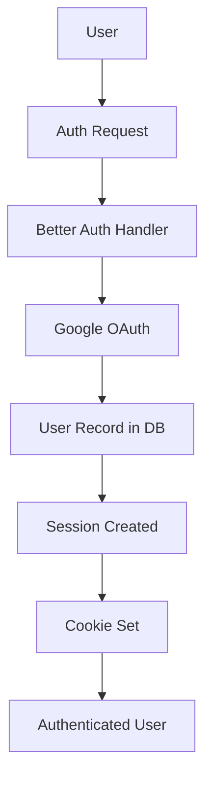

# Documentation

## Quick Links

- [Architecture](./architecture.md) - System design and patterns
- [Deployment](./deployment.md) - How to deploy to production
- [Workspace](./workspace/) - Task-specific docs and working notes

## Overview

This base template provides a complete, production-ready foundation for building modern full-stack applications with React, TanStack Start, Better Auth, Drizzle ORM, and Tailwind CSS.

## Architecture

### Monorepo Structure

The project uses PNPM workspaces to manage multiple packages:

- **apps/web**: Main web application using TanStack Start
- **packages/core**: Backend business logic and shared utilities
- **packages/ui**: Shared UI components with Shadcn

### Tech Stack Details

#### Frontend Stack
- **React 19**: Latest React with improved concurrent rendering
- **TanStack Start**: Full-stack React framework with SSR/SSG
- **TanStack Query**: Server state management with caching
- **Tailwind v4**: Utility-first CSS with CSS variables
- **Shadcn UI**: Accessible, customizable component library

#### Backend Stack
- **Better Auth**: Modern authentication library
- **Drizzle ORM**: TypeScript-first ORM
- **PostgreSQL**: Primary database
- **AI SDK v5**: Unified AI provider interface

### Key Design Decisions

#### Server Functions vs Server Routes

**Server Functions** (`createServerFn`)
- Use for: UI-triggered operations, internal RPC calls
- Characteristics: No stable URL, accessed from components/hooks
- Security: Internal only, not exposed externally
- Example: Form submissions, data fetching from UI

**Server Routes** (`createServerFileRoute`)
- Use for: Webhooks, cron jobs, external integrations
- Characteristics: Stable public URLs, dedicated endpoints
- Security: Implement authentication/rate limiting
- Example: Auth callbacks, webhook handlers

#### Authentication Flow

#### Database Schema

The base template includes minimal auth tables:
- `users`: User accounts
- `sessions`: Active sessions
- `accounts`: OAuth provider accounts
- `verifications`: Email verification tokens

Extend by adding your own tables in `packages/core/src/db/`.

#### AI Provider Integration

The AI provider facade (`packages/core/src/providers/ai/`) wraps the Vercel AI SDK to:
- Standardize model access across providers
- Enable quick provider switching
- Centralize configuration
- Type-safe API calls

See [architecture.md](./architecture.md) and [deployment.md](./deployment.md) for detailed guides.

