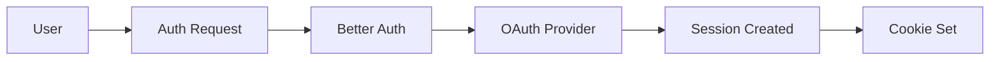

# Architecture

## Overview

Monorepo structure with three main packages:

```
apps/web        → Frontend + Server Functions
packages/core   → Backend logic, DB, Auth, AI
packages/ui     → Shared UI components
```

## Tech Stack

**Frontend**

- React 19 + TanStack Start (SSR)
- TanStack Query (data fetching)
- Tailwind v4 + Shadcn UI

**Backend**

- Better Auth (authentication)
- Drizzle ORM + PostgreSQL
- AI SDK v5 via AI Gateway

## Key Patterns

### Business Domain Organization

Business logic is organized by domain in `packages/core/src/business.server/`:

```
business.server/
  domain-name/
    domain.ts           # Business logic functions
    schemas/
      table1.sql.ts     # Table definition
      table2.sql.ts     # Related table
      schema.ts         # Domain exports
```

**Example:**

```typescript
// packages/core/src/business.server/posts/schemas/posts.sql.ts
// packages/core/src/business.server/posts/schemas/comments.sql.ts
import { bigSerialId, cuidId, timestamps, timestamps } from '~/drizzle.server/types';

export const PostsTable = pgTable('posts', {
  id: cuidId('id'), // User-facing: use CUID
  title: varchar('title', { length: 255 }).notNull(),
  authorId: text('author_id')
    .notNull()
    .references(() => UsersTable.id),
  ...timestamps, // Auto-adds createdAt, updatedAt
});

export const CommentsTable = pgTable('comments', {
  id: bigSerialId('id'), // Internal: use serial ID
  content: text('content').notNull(),
  postId: text('post_id')
    .notNull()
    .references(() => PostsTable.id),
  authorId: text('author_id')
    .notNull()
    .references(() => UsersTable.id, { onDelete: 'cascade' }),
  ...timestamps,
});

// packages/core/src/business.server/posts/schemas/schema.ts
export { PostsTable, type Post, type NewPost } from './posts.sql';

// packages/core/src/business.server/posts/posts.ts
export async function createPost(data: NewPost) {
  const [post] = await db.insert(PostsTable).values(data).returning();
  return post;
}
```

**ID Patterns:**

- **`cuidId('id')`** - Use for user-facing resources (posts, profiles, etc.)
  - Non-sequential, URL-safe
  - No enumeration attacks
- **`bigSerialId('id')`** - Use for internal tables (comments, logs, etc.)
  - Sequential, efficient
  - Fine for non-exposed resources

**Timestamps:**

- Use `...timestamps` spread for automatic `createdAt` and `updatedAt`
- `updatedAt` auto-updates on every change

**Benefits:**

- Clear separation of concerns by domain
- Schemas grouped with related tables
- Consistent ID and timestamp patterns
- Easy to find and maintain related code
- Type-safe table access

### Server Functions vs Routes

**Server Functions** - Use for UI operations:

```typescript
// apps/web/src/apis/my-feature.ts
export const myAction = createServerFn({ method: 'POST' })
  .validator(schema)
  .handler(async ({ data }) => {
    // Business logic
  });
```

**Server Routes** - Use for webhooks/external callers:

```typescript
// apps/web/src/routes/api.webhook.ts
export const ServerRoute = createServerFileRoute('/api/webhook').methods({
  POST: async ({ request }) => {
    // Handle webhook
  },
});
```

### Database Access

Always use Drizzle queries through the `db` instance:

```typescript
import { PostsTable } from '@base/core/business.server/posts/schemas/schema';
import { db, eq } from '@base/core/drizzle.server';

const post = await db.query.posts.findFirst({
  where: eq(PostsTable.id, postId),
});
```

**Relational Queries:**

Relations are defined in `schemas/schema.ts`:

```typescript
// packages/core/src/business.server/posts/schemas/schema.ts
import { relations } from 'drizzle-orm';

export const postsRelations = relations(PostsTable, ({ one, many }) => ({
  author: one(UsersTable, {
    fields: [PostsTable.authorId],
    references: [UsersTable.id],
  }),
  comments: many(CommentsTable),
}));

export const commentsRelations = relations(CommentsTable, ({ one }) => ({
  post: one(PostsTable, {
    fields: [CommentsTable.postId],
    references: [PostsTable.id],
  }),
  author: one(UsersTable, {
    fields: [CommentsTable.authorId],
    references: [UsersTable.id],
  }),
}));
```

Use relations in queries with `with`:

```typescript
// Fetch post with author and comments
const post = await db.query.posts.findFirst({
  where: eq(PostsTable.id, postId),
  with: {
    author: true,
    comments: {
      with: {
        author: true, // Nested relations
      },
    },
  },
});
```

### Environment Variables

Import validated env from central config:

```typescript
import { env } from '@base/core/config/env';

// Type-safe, validated at startup
const apiKey = env.AI_GATEWAY_API_KEY;
```

## Authentication Flow



## Adding Features

### 1. Create Domain Schema

```typescript
// packages/core/src/business.server/tasks/schemas/tasks.sql.ts
import { cuidId, timestamps } from '~/drizzle.server/types';

export const TasksTable = pgTable('tasks', {
  id: cuidId('id'), // User-facing resource
  title: text('title').notNull(),
  completed: boolean('completed').default(false),
  userId: text('user_id')
    .notNull()
    .references(() => UsersTable.id),
  ...timestamps, // Adds createdAt, updatedAt
});

export type Task = typeof TasksTable.$inferSelect;
export type NewTask = typeof TasksTable.$inferInsert;

// packages/core/src/business.server/tasks/schemas/schema.ts
export { TasksTable, type Task, type NewTask } from './tasks.sql';
```

### 2. Add Business Logic

```typescript
// packages/core/src/business.server/tasks/tasks.ts
import { db } from '~/drizzle.server';

import { TasksTable, type NewTask } from './schemas/schema';

export async function createTask(data: NewTask) {
  const [task] = await db.insert(TasksTable).values(data).returning();
  return task;
}
```

### 3. Register Schema

```typescript
// packages/core/src/drizzle.server/index.ts
import { TasksTable } from '~/business.server/tasks/schemas/schema';

export const schema = {
  // ... other tables
  tasks: TasksTable,
};
```

### 4. Generate Migration

```bash
pnpm db:generate
pnpm db:migrate
```

### 5. Create Server Function

```typescript
// apps/web/src/apis/tasks.ts
import { createTask } from '@base/core/business.server/tasks/tasks';

export const addTask = createServerFn({ method: 'POST' })
  .validator(z.object({ title: z.string() }))
  .handler(async ({ data }) => {
    return await createTask(data);
  });
```

### 6. Use in UI

```typescript
// apps/web/src/routes/tasks.tsx
import { useMutation } from '@tanstack/react-query';

import { addTask } from '~/apis/tasks';

function Tasks() {
  const mutation = useMutation({ mutationFn: addTask });
  // ...
}
```

## References

- [TanStack Start Docs](https://tanstack.com/start)
- [Drizzle ORM Docs](https://orm.drizzle.team)
- [Better Auth Docs](https://better-auth.com)
