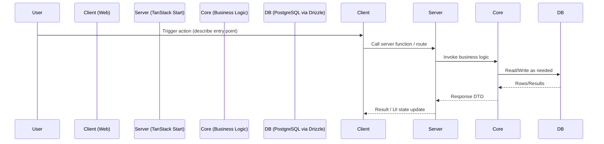

# Sample Task Plan Template

> Use this as a starting point for new task plans. Duplicate this folder, rename with the next task index and task name, and tailor each section. Keep the plan concise and high-signal.

## Feature/Task Overview
- Briefly describe the goal and the user impact.
- Explicitly list scope boundaries (what’s in vs out).
- Call out key architectural or product decisions that shape the work.

## Flow Visualization

## Relevant Files
- apps/web: pages, routes, components, server functions
- packages/core: `src/business.server/*`, `src/auth/*`, `src/utils/*`
- packages/ui: shared UI components (Shadcn)
- db/migrations: Drizzle migrations if schema changes

## References and Resources
- TanStack Start server functions and server routes
- Drizzle ORM and migrations
- AI Gateway integration and AI SDK v5 (if applicable)
- Internal docs and ADRs

## Task Breakdown

### Phase 1: Discovery and Design
- [ ] Validate requirements and constraints
- [ ] Draft API contracts (inputs/outputs, errors)
- [ ] Confirm data model impacts (new tables/columns?)

### Phase 2: Backend Implementation
- [ ] Create/modify server functions or server routes
- [ ] Add business logic in `packages/core/src/business.server/*`
- [ ] Generate and apply Drizzle migrations (if needed)
- [ ] Add logging via `logging.ts` utilities

### Phase 3: Frontend Integration
- [ ] Wire hooks with TanStack Query (queries/mutations)
- [ ] Build/extend UI using packages/ui components
- [ ] Handle optimistic updates, loading, and errors

### Phase 4: Validation and Hardening
- [ ] Add input validation and type-safe DTOs
- [ ] Add limits/rate checks or RBAC if required
- [ ] Add retries/backoff for flaky I/O

### Phase 5: Docs and Cleanup
- [ ] Update `docs/` behavior/contract docs if changed
- [ ] Remove dead code and legacy paths
- [ ] Ensure lints and typechecks pass

## Potential Risks / Edge Cases
- Data integrity and race conditions
- Idempotency for retried operations
- Performance hot paths (N+1, large payloads)
- Timezone handling (prefer UTC)
- Provider/API quota and error handling

## Testing Checklist
- [ ] Unit-level coverage for core logic
- [ ] End-to-end happy path
- [ ] Error states (timeouts, 4xx/5xx, validations)
- [ ] Access control (authn/authz) where applicable
- [ ] Migration up/down sanity

## Implementation Summary
- Summarize what was built and the key outcomes.
- Note any deviations from the original plan and rationale.

## Next Steps
- List follow-up items that didn’t make this scope.
- Infra or data backfills if needed.

## Notes
- Use `~/*` path alias within same package
- Prefer server functions for internal UI-triggered ops; server routes for external/public integrations
- Always generate migrations with Drizzle; don’t hand-edit tables
- Run in root: `pnpm typecheck` and `pnpm lint` before finalizing
