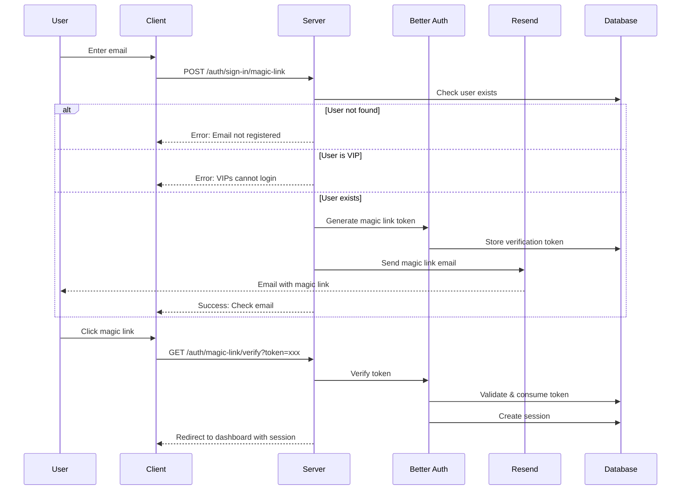
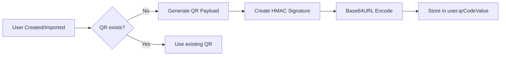
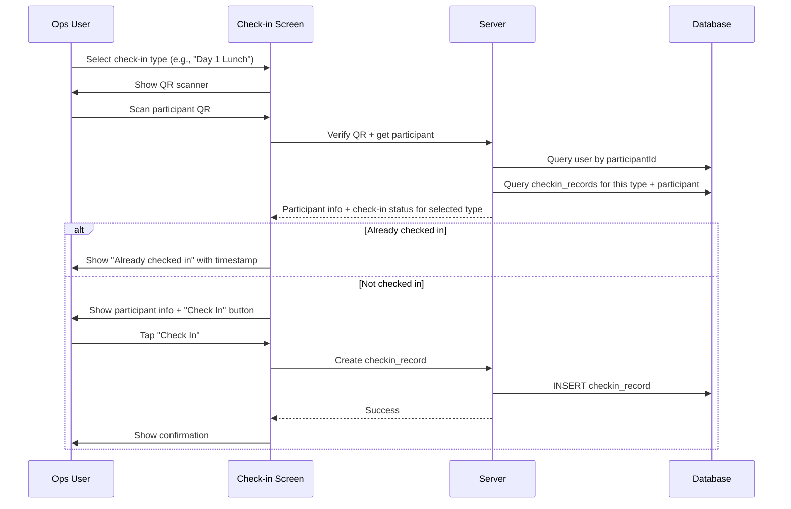
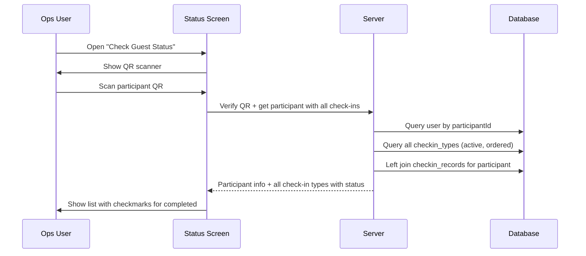

# Phase 1: Database Schema & Authentication

**Task ID:** 001  
**Priority:** Critical  
**Estimated Effort:** 1 day  
**Dependencies:** None

---

## 1. Feature Overview

This phase establishes the foundational database schema and authentication system for the hackathon platform. It includes:

- Extending the Better Auth user table with hackathon-specific fields (participant type, status, QR code, etc.)
- Creating new tables for credit types, codes, and flexible check-in system
- Configuring magic link authentication alongside existing Google OAuth
- Implementing QR code generation utilities with HMAC signature verification
- Setting up Resend email integration for magic link delivery
- Creating a seed script to bootstrap the initial admin user

**Success Criteria:**

- Migrations run successfully on empty database
- Magic link login flow works end-to-end
- Google OAuth continues working for admin/ops
- QR code generation and verification utilities tested
- Initial admin user seeded and can login

---

## 2. Flow Visualization

### 2.1 Authentication Flow



### 2.2 QR Code Generation Flow



### 2.3 Database Schema Relationships

```mermaid
erDiagram
    users ||--o{ codes : "assigned_to"
    users ||--o{ checkin_records : "participant_id"
    users ||--o{ checkin_records : "checked_in_by"
    credit_types ||--o{ codes : "credit_type_id"
    checkin_types ||--o{ checkin_records : "checkin_type_id"

    users {
        text id PK
        text email UK
        text name
        text role
        text participant_type
        text status
        timestamp checked_in_at
        text checked_in_by FK
        text qr_code_value
        text luma_id
    }

    credit_types {
        text id PK
        text name UK
        text display_name
        text email_instructions
        text web_instructions
        int display_order
        text icon_url
        boolean is_active
    }

    codes {
        text id PK
        text credit_type_id FK
        text code_value
        text redeem_url
        text assigned_to FK
        timestamp assigned_at
        text status
    }

    checkin_types {
        text id PK
        text name UK "Day 1 Attendance"
        text type "attendance | meal"
        text description "Instructions for ops"
        int display_order
        boolean is_active
        timestamp created_at
        timestamp updated_at
    }

    checkin_records {
        text id PK
        text checkin_type_id FK
        text participant_id FK
        text checked_in_by FK
        timestamp checked_in_at
        UNIQUE "checkin_type_id + participant_id"
    }
```

### 2.4 Ops Check-in Flow



### 2.5 Ops Check Guest Status Flow



---

## 3. Relevant Files

### Existing Files to Modify

| File                                        | Purpose                                                |
| ------------------------------------------- | ------------------------------------------------------ |
| `packages/core/src/auth/schema.ts`          | Add hackathon-specific columns to UsersTable           |
| `packages/core/src/auth/auth.ts`            | Configure magic link plugin, add user additionalFields |
| `packages/core/src/drizzle.server/index.ts` | Register new schema tables and relations               |
| `packages/core/src/config/env.ts`           | Add QR_SECRET_KEY, RESEND_API_KEY                      |
| `apps/web/src/utils/auth-client.ts`         | Add magicLinkClient plugin                             |

### New Files to Create

| File                                                                      | Purpose                                     |
| ------------------------------------------------------------------------- | ------------------------------------------- |
| `packages/core/src/business.server/events/schemas/credit-types.sql.ts`    | Credit types table definition               |
| `packages/core/src/business.server/events/schemas/codes.sql.ts`           | Codes table definition                      |
| `packages/core/src/business.server/events/schemas/checkin-types.sql.ts`   | Check-in types table definition             |
| `packages/core/src/business.server/events/schemas/checkin-records.sql.ts` | Check-in records table definition           |
| `packages/core/src/business.server/events/schemas/schema.ts`              | Schema exports + relations                  |
| `packages/core/src/business.server/events/events.ts`                      | QR generation/verification + business logic |
| `packages/core/src/email/client.ts`                                       | Resend client setup                         |
| `packages/core/src/email/templates/magic-link.ts`                         | Magic link email template                   |
| `packages/core/src/db/seed.ts`                                            | Database seeding script                     |

---

## 4. References and Resources

| Resource                        | URL                                                                  | Purpose                   |
| ------------------------------- | -------------------------------------------------------------------- | ------------------------- |
| Better Auth - Magic Link Plugin | https://www.better-auth.com/docs/plugins/magic-link                  | Magic link configuration  |
| Better Auth - Additional Fields | https://www.better-auth.com/docs/concepts/database#additional-fields | Extending user schema     |
| Drizzle ORM - PostgreSQL        | https://orm.drizzle.team/docs/get-started-postgresql                 | Schema definitions        |
| Resend Node SDK                 | https://resend.com/docs/send-with-nodejs                             | Email sending             |
| Node.js Crypto                  | https://nodejs.org/api/crypto.html                                   | HMAC signature generation |

---

## 5. Task Breakdown

## Phase A: Environment & Dependencies

### Task A.1: Add Environment Variables

**Description:** Add new environment variables for QR code signing and email delivery.

**Relevant files:** `packages/core/src/config/env.ts`

- [x] Add `QR_SECRET_KEY` with min 32 character validation
- [x] Add `RESEND_API_KEY` validation
- [x] Add `EMAIL_FROM` with default `noreply@cursorhackathon.pebbletech.my`
- [ ] Update `.env.example` with new variables

### Task A.2: Install Dependencies

**Description:** Add required npm packages for email and QR functionality.

**Relevant files:** `packages/core/package.json`

- [x] Add `resend` package for email delivery
- [x] Verify `crypto` is available (Node.js built-in, no install needed)

---

## Phase B: Database Schema

### Task B.1: Extend Users Table

**Description:** Add hackathon-specific fields to the Better Auth users table using the additionalFields configuration pattern.

**Relevant files:** `packages/core/src/auth/schema.ts`, `packages/core/src/auth/auth.ts`

- [x] Add columns to UsersTable schema: `lumaId`, `participantType`, `status`, `checkedInAt`, `checkedInBy`, `qrCodeValue`
- [x] Configure `user.additionalFields` in Better Auth config with proper types and defaults
- [x] Set `input: false` for server-controlled fields (role, status, qrCodeValue)
- [x] Add database indexes for frequently queried columns (email, lumaId, status, role)

**Field Specifications:**

| Field           | Type   | Default      | Input | Description                  |
| --------------- | ------ | ------------ | ----- | ---------------------------- |
| lumaId          | string | null         | false | Luma registration ID         |
| participantType | string | "regular"    | false | "regular" or "vip"           |
| status          | string | "registered" | false | "registered" or "checked_in" |
| checkedInAt     | date   | null         | false | Check-in timestamp           |
| checkedInBy     | string | null         | false | User ID of ops who processed |
| qrCodeValue     | string | null         | false | HMAC-signed QR payload       |

### Task B.2: Create Credit Types Table

**Description:** Define the credit types schema for sponsor credits.

**Relevant files:** `packages/core/src/hackathon.server/schemas/credit-types.sql.ts`

- [x] Create CreditTypesTable with fields: id, name, displayName, emailInstructions, webInstructions, displayOrder, iconUrl, isActive
- [x] Add unique constraint on `name`
- [x] Add indexes on displayOrder and isActive
- [x] Export type definitions (CreditType, NewCreditType)

### Task B.3: Create Codes Table

**Description:** Define the codes schema for individual sponsor redemption codes.

**Relevant files:** `packages/core/src/hackathon.server/schemas/codes.sql.ts`

- [x] Create CodesTable with fields: id, creditTypeId, codeValue, redeemUrl, assignedTo, assignedAt, redeemedAt, status
- [x] Add foreign key to credit_types with ON DELETE RESTRICT
- [x] Add foreign key to users (assignedTo) with ON DELETE SET NULL
- [x] Add composite index on (creditTypeId, status) for assignment queries
- [x] Add unique constraint on (creditTypeId, codeValue) to prevent duplicate imports
- [x] Export type definitions and status enum

### Task B.4: Create Check-in Types Table

**Description:** Define the check-in types schema for configurable check-in categories (attendance, meals, etc.).

**Relevant files:** `packages/core/src/business.server/events/schemas/checkin-types.sql.ts`

- [x] Create CheckinTypesTable with fields: id, name, type, description, displayOrder, isActive
- [x] Add unique constraint on `name`
- [x] Define type enum: 'attendance' | 'meal'
- [x] Add indexes on displayOrder and isActive
- [x] Export type definitions (CheckinType, NewCheckinType)

**Field Specifications:**

| Field        | Type    | Required | Description                            |
| ------------ | ------- | -------- | -------------------------------------- |
| id           | cuid    | yes      | Primary key                            |
| name         | text    | yes      | Unique name (e.g., "Day 1 Attendance") |
| type         | enum    | yes      | 'attendance' or 'meal'                 |
| description  | text    | no       | Instructions shown to ops              |
| displayOrder | int     | yes      | Order in ops UI                        |
| isActive     | boolean | yes      | Can disable without deleting           |

### Task B.5: Create Check-in Records Table

**Description:** Define the check-in records schema to track participant check-ins.

**Relevant files:** `packages/core/src/business.server/events/schemas/checkin-records.sql.ts`

- [x] Create CheckinRecordsTable with fields: id, checkinTypeId, participantId, checkedInBy, checkedInAt
- [x] Add unique constraint on (checkinTypeId, participantId) for duplicate prevention
- [x] Add foreign key to checkin_types with ON DELETE RESTRICT
- [x] Add foreign keys to users table (participantId, checkedInBy)
- [x] Add index on checkedInAt for queries
- [x] Export type definitions (CheckinRecord, NewCheckinRecord)

### Task B.6: Create Relations

**Description:** Define Drizzle ORM relations for type-safe queries with joins.

**Relevant files:** `packages/core/src/business.server/events/schemas/schema.ts`

- [x] Define usersRelations (assignedCodes, checkinRecords, processedCheckins, checkedInByUser)
- [x] Define creditTypesRelations (codes)
- [x] Define codesRelations (creditType, assignedToUser)
- [x] Define checkinTypesRelations (checkinRecords)
- [x] Define checkinRecordsRelations (checkinType, participant, processedBy)

### Task B.7: Schema Exports and Registration

**Description:** Export all schemas and register them in the drizzle client.

**Relevant files:** `packages/core/src/hackathon.server/schemas/index.ts`, `packages/core/src/drizzle.server/index.ts`

- [x] Create index.ts exporting all tables, types, and relations
- [x] Update drizzle.server/index.ts to include new schemas
- [x] Update drizzle.config.ts schema glob pattern if needed

### Task B.8: Generate and Run Migrations

**Description:** Generate migration files and apply to database.

- [x] Run `pnpm db:generate` to create migration files
- [ ] Review generated SQL for correctness
- [ ] Run `pnpm db:migrate` to apply migrations
- [ ] Verify tables created correctly

---

## Phase C: Authentication

### Task C.1: Configure Magic Link Plugin

**Description:** Add magic link authentication to Better Auth configuration.

**Relevant files:** `packages/core/src/auth/auth.ts`

- [x] Import and add `magicLink` plugin to auth config
- [x] Set `expiresIn: 3600` (1 hour)
- [x] Set `disableSignUp: true` (only pre-imported users can login)
- [x] Implement `sendMagicLink` callback that validates user and calls email service
- [x] Add VIP login prevention check in sendMagicLink

### Task C.2: Create Email Client

**Description:** Set up Resend client for email delivery.

**Relevant files:** `packages/core/src/email/client.ts`

- [x] Initialize Resend client with API key from env
- [x] Create `sendEmail` helper function with error handling
- [x] Export email sending utilities

### Task C.3: Create Magic Link Email Template

**Description:** Create HTML email template for magic link delivery.

**Relevant files:** `packages/core/src/email/templates/magic-link.ts`

- [x] Create `sendMagicLinkEmail` function
- [x] Design mobile-responsive HTML template
- [x] Include: greeting, magic link button, expiry note (1 hour), plain text fallback
- [x] Use sender: `noreply@cursorhackathon.pebbletech.my`

### Task C.4: Update Auth Client

**Description:** Add magic link plugin to client-side auth configuration.

**Relevant files:** `apps/web/src/utils/auth-client.ts`

- [x] Import `magicLinkClient` from better-auth/client/plugins
- [x] Add plugin to createAuthClient configuration
- [x] Verify TypeScript types are properly inferred

---

## Phase D: QR Code Utilities

### Task D.1: Implement QR Code Generation

**Description:** Create utility to generate permanent, signed QR code values.

**Relevant files:** `packages/core/src/hackathon.server/qr-code.ts`

- [x] Define QRPayload interface with participantId, type, signature
- [x] Implement `generateQRCodeValue(participantId)` function
- [x] Use HMAC-SHA256 with QR_SECRET_KEY for signature
- [x] Encode payload as base64url JSON

### Task D.2: Implement QR Code Verification

**Description:** Create utility to verify and decode QR code values.

**Relevant files:** `packages/core/src/hackathon.server/qr-code.ts`

- [x] Implement `verifyQRCodeValue(qrValue)` function
- [x] Decode base64url and parse JSON
- [x] Verify HMAC signature matches
- [x] Return typed result: `{ valid: true, participantId }` or `{ valid: false, error }`

---

## Phase E: Database Seeding

### Task E.1: Create Seed Script

**Description:** Create a database seeding script to bootstrap initial admin user.

**Relevant files:** `packages/core/src/db/seed.ts`

- [x] Create seed function that creates admin user: `kong@pebbletech.my`
- [x] Set user fields: role='admin', participantType='regular', status='registered'
- [x] Generate QR code value for admin
- [x] Handle idempotency (don't duplicate if already exists)
- [x] Add npm script: `pnpm db:seed`

### Task E.2: Update Package Scripts

**Description:** Add seed script to package.json.

**Relevant files:** `packages/core/package.json`

- [x] Add `db:seed` script that runs the seed file

---

## Dependencies

```
Phase A (Environment)
    └── Phase B (Schema) - needs env vars for migration
            └── Phase C (Auth) - needs schema for magic link
            └── Phase D (QR Utils) - needs env vars for secret key
                    └── Phase E (Seeding) - needs all above to create admin
```

---

## 6. Potential Risks / Edge Cases

### Schema Migration Risks

- **Enum type changes:** If `role` column needs to change from text to enum in future, requires careful migration
- **Foreign key ordering:** Tables must be created in correct order (users before codes, credit_types before codes)

### Authentication Edge Cases

- **VIP login attempts:** VIPs will receive a clear error message, not a generic "email not found"
- **Rate limiting:** Magic link requests should be rate-limited (Better Auth default: 5 per 15 min)
- **Token expiry:** Users clicking expired links should get clear error with option to request new link
- **Email delivery failures:** Log failures for admin review; user should be able to retry

### QR Code Security

- **Secret key rotation:** If QR_SECRET_KEY changes, all existing QR codes become invalid
- **Replay attacks:** QR codes are permanent by design; duplicate prevention is handled at check-in time, not in QR validation

### Database Constraints

- **Unique email:** Import process must handle duplicate emails gracefully
- **Check-in duplicates:** Unique constraint on (checkinTypeId, participantId) will throw on duplicate; catch and return friendly error

---

## 7. Testing Checklist

### Environment Setup

- [ ] All new environment variables are documented in .env.example
- [ ] Application starts without errors with new env vars set
- [ ] Application fails gracefully with clear error if env vars missing

### Database Schema

- [ ] Migration runs successfully on fresh database
- [ ] All tables created with correct columns and types
- [ ] Foreign key relationships work (insert/delete cascade)
- [ ] Unique constraints prevent duplicates
- [ ] Indexes are created for performance-critical columns

### Magic Link Authentication

- [ ] User can request magic link with registered email
- [ ] User sees error for unregistered email
- [ ] VIP user sees specific error message (not generic)
- [ ] Magic link email is received within 30 seconds
- [ ] Clicking valid magic link logs user in and redirects to dashboard
- [ ] Clicking expired link shows clear error message
- [ ] Token is single-use (second click fails)
- [ ] Session persists for 7 days

### Google OAuth (Existing)

- [ ] Google OAuth still works for admin/ops users
- [ ] Session handling consistent between magic link and OAuth

### QR Code Utilities

- [ ] generateQRCodeValue produces consistent output for same participantId
- [ ] verifyQRCodeValue correctly validates genuine QR codes
- [ ] verifyQRCodeValue rejects tampered signatures
- [ ] verifyQRCodeValue rejects malformed/invalid input

### Database Seeding

- [ ] Seed script creates initial admin user
- [ ] Admin user has correct role and fields
- [ ] Admin user has QR code generated
- [ ] Running seed twice doesn't create duplicate
- [ ] Admin can login via Google OAuth or magic link

---

## 8. Notes

### Email Sender Configuration

- Sender address: `noreply@cursorhackathon.pebbletech.my`
- Requires domain verification in Resend dashboard before emails will deliver

### Better Auth Additional Fields Pattern

The `additionalFields` approach in Better Auth config is preferred over modifying the schema directly because:

1. Fields are automatically typed in session/user objects
2. `input: false` prevents users from setting server-controlled fields during signup
3. Default values are handled consistently

### QR Code Payload Format

```json
{
  "participantId": "cuid_xxx",
  "type": "permanent",
  "signature": "hmac_sha256_hex_string"
}
```

Encoded as base64url for compact QR representation.

### Initial Admin Bootstrap

The seed script should be run once during initial deployment:

```bash
pnpm db:migrate  # Apply schema
pnpm db:seed     # Create initial admin
```

After that, the admin can add other admins/ops via the Admin Dashboard (Phase 2).

### Check-in System Design

The check-in system is flexible and admin-configurable:

**Check-in Types (seeded by admin):**

| name             | type       | display_order |
| ---------------- | ---------- | ------------- |
| Day 1 Attendance | attendance | 1             |
| Day 1 Lunch      | meal       | 2             |
| Day 1 Dinner     | meal       | 3             |
| Day 2 Attendance | attendance | 4             |
| Day 2 Breakfast  | meal       | 5             |

**Two Ops Flows:**

1. **Check-in Guest** (single-purpose, fast)
   - Ops selects check-in type first (e.g., "Day 1 Lunch")
   - Scans participant QR
   - Shows participant info + status for that specific type only
   - If not checked in → show "Check In" button
   - If already checked in → show timestamp

2. **Check Guest Status** (overview)
   - Scans participant QR
   - Shows participant info + ALL check-in types
   - Each type shows checkmark if completed
   - Read-only view for status checking
