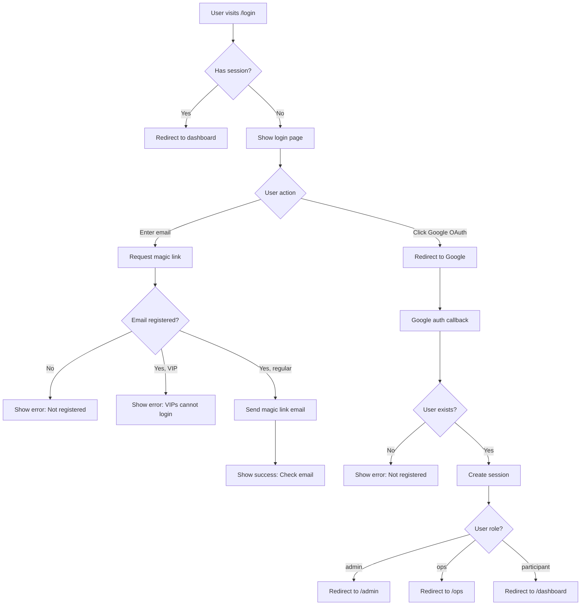
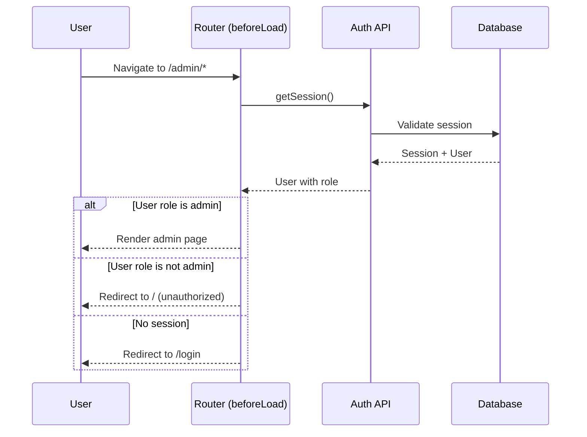
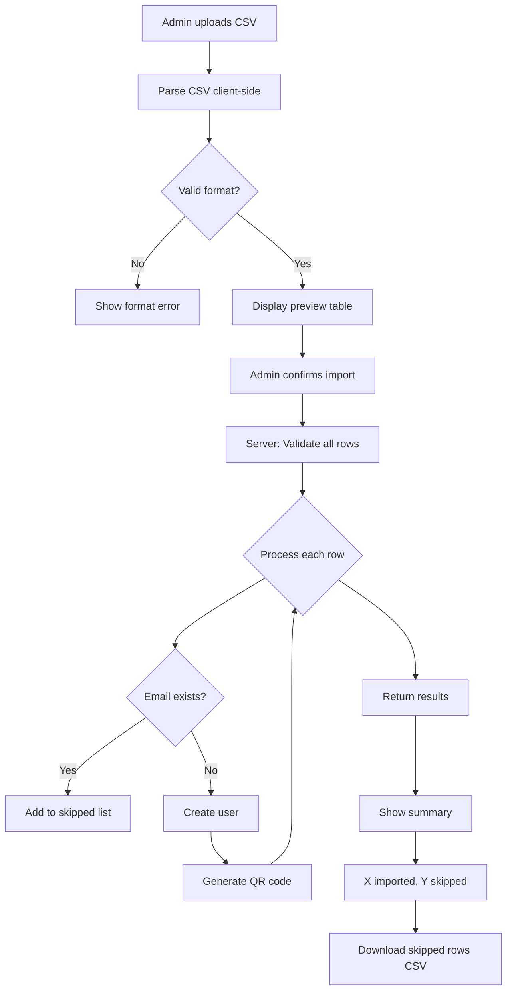
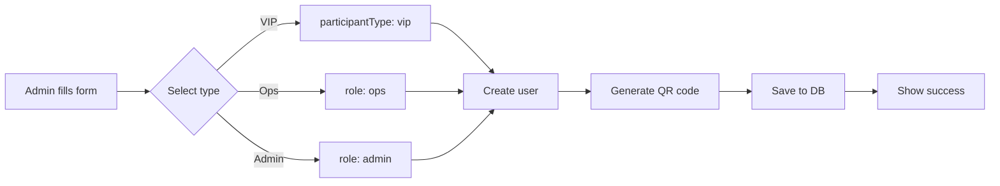
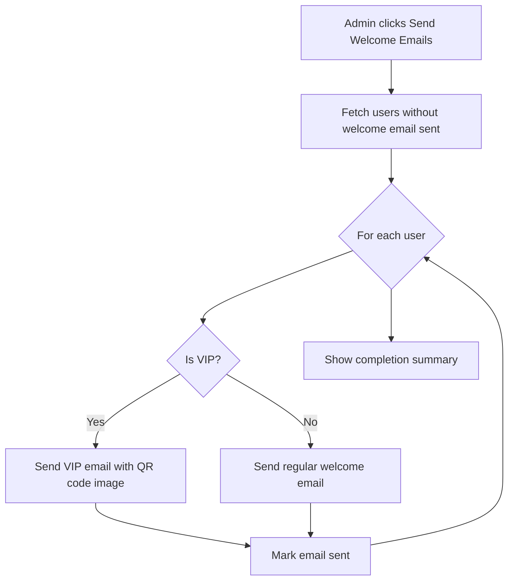

# Phase 2: Admin - Participant Import

**Task ID:** 002  
**Priority:** Critical  
**Estimated Effort:** 0.5 day  
**Dependencies:** Phase 1 (completed)

---

## 1. Feature Overview

This phase implements the admin functionality for importing and managing participants. Key capabilities include:

- **Login Page**: Unified login page with magic link (participants) and Google OAuth (ops/admin)
- **Admin Route Protection**: Role-based access control for admin routes using `beforeLoad` guards
- **CSV Bulk Import**: Upload participants from Luma CSV export with validation and error reporting
- **Manual User Creation**: Add VIP, Ops, or Admin accounts individually with immediate QR code generation
- **Participant List**: Server-side paginated list with filtering by status, type, role, and search
- **Welcome Email Trigger**: Batch send welcome emails (different content for regular vs VIP)

**Success Criteria:**

- Users can login via magic link (participants) or Google OAuth (ops/admin)
- Admin can import 1000 participants from Luma CSV
- Partial imports work with detailed skip reporting
- Admin can manually add VIP/Ops/Admin accounts
- QR codes auto-generated for all users on creation
- Participant list loads efficiently with filters and pagination

---

## 2. Flow Visualization

### 2.1 Login Flow



### 2.2 Admin Route Protection Flow



### 2.3 CSV Import Flow



### 2.4 Manual User Creation Flow



### 2.5 Welcome Email Flow



---

## 3. Relevant Files

### Existing Files to Reference

| File                                                 | Purpose                                           |
| ---------------------------------------------------- | ------------------------------------------------- |
| `packages/core/src/auth/schema.ts`                   | UsersTable definition with all participant fields |
| `packages/core/src/auth/auth.ts`                     | Better Auth config with magic link                |
| `packages/core/src/business.server/events/events.ts` | QR code generation utilities                      |
| `packages/core/src/drizzle.server/index.ts`          | Database client and schema exports                |
| `packages/core/src/email/client.ts`                  | Resend email client                               |
| `packages/core/src/email/templates/magic-link.ts`    | Email template pattern reference                  |
| `packages/core/src/config/constant.ts`               | Role, status, type constants                      |
| `apps/web/src/routes/__root.tsx`                     | Root route pattern                                |
| `apps/web/src/apis/ping.ts`                          | Server function pattern reference                 |
| `apps/web/src/utils/auth-client.ts`                  | Auth client setup                                 |

### New Files to Create

| File                                               | Purpose                                          |
| -------------------------------------------------- | ------------------------------------------------ |
| `apps/web/src/routes/login.tsx`                    | Login page with magic link and Google OAuth      |
| `apps/web/src/apis/auth.ts`                        | Auth server functions (getSession, etc.)         |
| `apps/web/src/routes/admin.tsx`                    | Admin layout route with role guard               |
| `apps/web/src/routes/admin/index.tsx`              | Admin dashboard index (redirect to participants) |
| `apps/web/src/routes/admin/participants.tsx`       | Participant list page                            |
| `apps/web/src/apis/admin/participants.ts`          | Server functions for participant CRUD            |
| `apps/web/src/apis/admin/emails.ts`                | Server functions for welcome emails              |
| `packages/core/src/email/templates/welcome.ts`     | Welcome email template (regular participants)    |
| `packages/core/src/email/templates/welcome-vip.ts` | VIP welcome email template with QR               |
| `packages/ui/src/components/data-table.tsx`        | Reusable data table component                    |
| `packages/ui/src/components/file-upload.tsx`       | Drag-drop file upload component                  |

---

## 4. References and Resources

| Resource                          | URL                                                                           | Purpose                   |
| --------------------------------- | ----------------------------------------------------------------------------- | ------------------------- |
| Better Auth - Magic Link          | https://www.better-auth.com/docs/plugins/magic-link                           | Magic link client usage   |
| Better Auth - Social Sign-in      | https://www.better-auth.com/docs/authentication/social-sign-in                | Google OAuth integration  |
| TanStack Start - File Routing     | https://tanstack.com/start/latest/docs/framework/react/guide/routing          | Route file conventions    |
| TanStack Start - beforeLoad       | https://tanstack.com/start/latest/docs/framework/react/guide/authentication   | Route protection pattern  |
| TanStack Start - Server Functions | https://tanstack.com/start/latest/docs/framework/react/guide/server-functions | Server function patterns  |
| TanStack Query - Mutations        | https://tanstack.com/query/latest/docs/framework/react/guides/mutations       | Mutation patterns         |
| Drizzle ORM - Insert              | https://orm.drizzle.team/docs/insert                                          | Bulk insert patterns      |
| Shadcn UI - Data Table            | https://ui.shadcn.com/docs/components/data-table                              | Table component reference |
| Papaparse                         | https://www.papaparse.com/                                                    | CSV parsing library       |

---

## 5. Task Breakdown

## Phase 0: Authentication UI

### Task 0.1: Create Login Page

**Description:** Create the unified login page with both magic link and Google OAuth options.

**Relevant files:** `apps/web/src/routes/login.tsx`

- [x] Create `login.tsx` route with `createFileRoute`
- [x] Add `beforeLoad` to redirect authenticated users to appropriate dashboard
- [x] Design mobile-first login UI with two sections:
  - Magic link section: Email input + "Send Magic Link" button
  - OAuth section: "Continue with Google" button
- [x] Show clear messaging about who should use which method

### Task 0.2: Implement Magic Link Login Flow

**Description:** Wire up the magic link authentication flow on the login page.

**Relevant files:** `apps/web/src/routes/login.tsx`

- [x] Use `authClient.signIn.magicLink()` from auth-client
- [x] Handle loading state during request
- [x] Show success message: "Check your email for the login link"
- [x] Handle errors: "Email not registered", "VIPs cannot login"
- [x] Add callbackURL to redirect after magic link verification

### Task 0.3: Implement Google OAuth Login Flow

**Description:** Wire up Google OAuth login for ops/admin users.

**Relevant files:** `apps/web/src/routes/login.tsx`

- [x] Use `authClient.signIn.social({ provider: 'google' })`
- [x] Handle OAuth callback redirect
- [x] Redirect to appropriate dashboard based on role after login

### Task 0.4: Create Auth Server Function

**Description:** Create reusable server function to get current session.

**Relevant files:** `apps/web/src/apis/auth.ts`

- [x] Create `getServerSession` server function
- [x] Return typed session with user data including role
- [x] Handle no-session case gracefully

### Task 0.5: Post-Login Redirect Logic

**Description:** Implement redirect logic after successful authentication.

**Relevant files:** `apps/web/src/routes/login.tsx`, `apps/web/src/routes/__root.tsx`

- [x] After magic link verification, redirect based on role
- [x] After Google OAuth, redirect based on role
- [x] Admin → `/admin`, Ops → `/ops` (future), Participant → `/dashboard` (future)
- [x] For now, redirect non-admin to `/` with appropriate message

---

## Phase A: Admin Route Infrastructure

### Task A.1: Create Admin Layout Route

**Description:** Create the admin layout route with role-based protection using `beforeLoad`.

**Relevant files:** `apps/web/src/routes/admin.tsx`

- [x] Create `admin.tsx` layout route using `createFileRoute`
- [x] Implement `beforeLoad` to check session and admin role
- [x] Redirect to `/` if not admin, redirect to login page if no session
- [x] Pass user context to child routes
- [x] Add basic admin layout with navigation sidebar

### Task A.2: Create Auth Utilities

**Description:** Create reusable auth utilities for server-side session checking.

**Relevant files:** `apps/web/src/apis/auth.ts`

- [x] Create `getServerSession` server function to get current session
- [x] Create helper to validate session has required role
- [x] Export typed user and session interfaces

### Task A.3: Create Admin Index Route

**Description:** Create admin index page that redirects to participants list.

**Relevant files:** `apps/web/src/routes/admin/index.tsx`

- [x] Create index route under admin directory
- [x] Redirect to `/admin/participants` or show simple dashboard placeholder

---

## Phase B: CSV Import Feature

### Task B.1: Create File Upload Component

**Description:** Create reusable drag-drop file upload component for CSV files.

**Relevant files:** `packages/ui/src/components/file-upload.tsx`

- [x] Create file upload component with drag-drop zone
- [x] Support click-to-browse fallback
- [x] Accept only `.csv` files
- [x] Show selected file name and size
- [x] Emit file content to parent component

### Task B.2: Create CSV Parser Utility

**Description:** Create utility to parse and validate Luma CSV format.

**Relevant files:** `apps/web/src/utils/csv-parser.ts`

- [x] Install and configure Papaparse
- [x] Parse CSV with header row detection
- [x] Extract required columns: `email`, `name`, `luma_id` (ignore extras)
- [x] Validate email format for each row
- [x] Return parsed data with row numbers for error reporting

### Task B.3: Create Participant Import Server Function

**Description:** Server function to bulk import participants with duplicate handling.

**Relevant files:** `apps/web/src/apis/admin/participants.ts`

- [x] Create `importParticipants` server function with role validation
- [x] Accept array of participant data
- [x] Query existing emails to detect duplicates
- [x] Bulk insert valid participants with generated QR codes
- [x] Return detailed results: imported count, skipped rows with reasons

### Task B.4: Create Import UI Page

**Description:** Build the CSV import interface on the participants page.

**Relevant files:** `apps/web/src/routes/admin/participants.tsx`

- [x] Add "Import Participants" button that opens dialog/modal
- [x] Integrate file upload component
- [x] Show preview table after CSV parsing (first 10 rows)
- [x] Display total row count and validation status
- [x] Submit button triggers server import
- [x] Show results dialog with import summary
- [x] Provide "Download Skipped Rows" as CSV for review

---

## Phase C: Manual User Creation

### Task C.1: Create Manual User Form Component

**Description:** Form to manually add VIP, Ops, or Admin users.

**Relevant files:** `apps/web/src/routes/admin/participants.tsx`

- [x] Create form with fields: Name, Email, Type selector (VIP/Ops/Admin)
- [x] Type selector determines: VIP sets `participantType`, Ops/Admin sets `role`
- [x] Client-side validation (required fields, email format)
- [x] Submit to server function

### Task C.2: Create Single User Server Function

**Description:** Server function to create individual users.

**Relevant files:** `apps/web/src/apis/admin/participants.ts`

- [x] Create `createUser` server function with role validation
- [x] Accept name, email, userType (vip/ops/admin)
- [x] Check for duplicate email
- [x] Generate QR code value
- [x] Insert user with appropriate role and participantType
- [x] Return created user or error

---

## Phase D: Participant List View

### Task D.1: Create Data Table Component

**Description:** Create reusable server-side paginated data table component.

**Relevant files:** `packages/ui/src/components/data-table.tsx`

- [x] Create table component with column definitions
- [x] Support server-side pagination (page, pageSize)
- [x] Support sorting by column
- [x] Integrate with TanStack Table for headless logic
- [x] Style with Tailwind

### Task D.2: Create List Participants Server Function

**Description:** Server function to fetch paginated participant list with filters.

**Relevant files:** `apps/web/src/apis/admin/participants.ts`

- [x] Create `listParticipants` server function
- [x] Accept parameters: page, pageSize, filters (status, participantType, role), search
- [x] Build dynamic query with filters
- [x] Return paginated results with total count

### Task D.3: Build Participant List UI

**Description:** Implement participant list page with filters and pagination.

**Relevant files:** `apps/web/src/routes/admin/participants.tsx`

- [x] Integrate data table component
- [x] Add filter controls: status dropdown, type dropdown, role dropdown
- [x] Add search input for name/email
- [x] Display columns: Name, Email, Status badge, Type, Role
- [x] Add pagination controls
- [x] Use TanStack Query for data fetching with proper cache invalidation

---

## Phase E: Welcome Emails

### Task E.1: Create Welcome Email Template

**Description:** Create welcome email template for regular participants.

**Relevant files:** `packages/core/src/email/templates/welcome.ts`

- [x] Create HTML template with platform URL
- [x] Include login instructions (use email for magic link)
- [x] Include event date/time info (Dec 6-7)
- [x] Include venue info (Level 2, Monash University)
- [x] Mobile-responsive design

### Task E.2: Create VIP Welcome Email Template

**Description:** Create VIP email template with embedded QR code.

**Relevant files:** `packages/core/src/email/templates/welcome-vip.ts`

- [x] Create HTML template with QR code image embedded
- [x] Include food schedule info
- [x] Explain QR code usage (show at food stations)
- [x] Note that QR never expires
- [x] No login instructions (VIPs don't login)

### Task E.3: Create QR Code Image Generator

**Description:** Utility to generate QR code as PNG buffer for email embedding.

**Relevant files:** `packages/core/src/business.server/events/qr-image.ts`

- [x] Install `qrcode` package if not present
- [x] Create function to generate QR code PNG buffer from value
- [x] Support configurable size (default 400x400)
- [x] Return base64 data URL for email embedding

### Task E.4: Create Send Welcome Emails Server Function

**Description:** Server function to send welcome emails to all participants.

**Relevant files:** `apps/web/src/apis/admin/emails.ts`

- [x] Create `sendWelcomeEmails` server function
- [x] Add `welcomeEmailSentAt` field to track sent status (may need migration)
- [x] Fetch users who haven't received welcome email
- [x] For each user: send appropriate email type (regular vs VIP)
- [x] Update `welcomeEmailSentAt` after successful send
- [x] Return summary (sent count, failed count)

### Task E.5: Add Welcome Email UI Trigger

**Description:** Add "Send Welcome Emails" button to admin UI.

**Relevant files:** `apps/web/src/routes/admin/participants.tsx`

- [x] Add "Send Welcome Emails" button in header area
- [x] Show confirmation dialog with count of unsent emails
- [x] Progress indicator during batch send
- [x] Show results summary on completion

---

## Dependencies

```
Phase 0 (Authentication UI)
    └── Phase A (Admin Routes) - needs login to access
            └── Phase B (CSV Import) - needs admin protection
            └── Phase C (Manual Creation) - needs admin protection
            └── Phase D (Participant List) - needs admin protection
                    └── Phase E (Welcome Emails) - needs list to trigger from
```

Phase 0 must be completed first to enable admin login.
Phase B, C, D can be developed in parallel after Phase A.
Phase E requires Phase D and potentially a schema migration for `welcomeEmailSentAt`.

---

## 6. Potential Risks / Edge Cases

### CSV Import Risks

- **Large file handling**: 1000+ row CSV should be processed server-side in chunks if needed
- **Encoding issues**: CSV may have UTF-8 BOM or different encodings; Papaparse handles most cases
- **Malformed rows**: Rows with wrong column count should be skipped with clear error message
- **Email normalization**: Consider lowercasing emails before duplicate check

### Database Constraints

- **Unique email violation**: Handle gracefully, add to skipped list
- **Transaction size**: For 1000 inserts, consider batching in groups of 100
- **QR code generation**: Synchronous generation for each user; should be fast but monitor

### Authentication Edge Cases

- **Session expiry during import**: Long imports should not be interrupted by session timeout
- **Concurrent admin access**: Two admins importing simultaneously should not create duplicates (email unique constraint handles this)

### Email Delivery

- **Rate limiting**: Resend has rate limits; may need to batch email sending with delays
- **Failed deliveries**: Track failures, allow retry mechanism
- **Large batch**: 1000 emails should be sent with progress tracking

### UI/UX Considerations

- **Import preview**: Don't load entire CSV into browser memory for preview; show first 10 rows
- **Download skipped rows**: Generate CSV client-side from returned skip data
- **Loading states**: All async operations need clear loading indicators

---

## 7. Testing Checklist

### Login Page

- [ ] Login page loads at `/login`
- [ ] Authenticated user redirected away from login page
- [ ] Magic link: valid email shows "Check your email" message
- [ ] Magic link: unregistered email shows error message
- [ ] Magic link: VIP email shows "VIPs cannot login" error
- [ ] Google OAuth: clicking button redirects to Google
- [ ] Google OAuth: successful auth creates session
- [ ] Google OAuth: unregistered Google account shows error
- [ ] Post-login: admin user redirected to `/admin`
- [ ] Post-login: ops user redirected appropriately (or `/` for now)
- [ ] Post-login: participant redirected appropriately (or `/` for now)

### Admin Route Protection

- [ ] Non-authenticated user redirected to login page
- [ ] Authenticated non-admin user redirected to home page
- [ ] Authenticated admin user can access admin routes
- [ ] Admin context (user data) available in child routes

### CSV Import

- [ ] Valid CSV with 10 rows imports all 10 participants
- [ ] CSV with 5 duplicate emails imports 5, skips 5 with reasons
- [ ] CSV with missing email column shows format error
- [ ] CSV with invalid email format in row 3 skips row 3 with reason
- [ ] Extra columns in CSV are ignored
- [ ] Empty CSV shows appropriate message
- [ ] Large CSV (1000 rows) imports without timeout
- [ ] QR code generated for each imported user
- [ ] Skipped rows CSV downloadable with correct data

### Manual User Creation

- [ ] Creating VIP sets participantType to 'vip' and role to 'participant'
- [ ] Creating Ops sets role to 'ops' and participantType to 'regular'
- [ ] Creating Admin sets role to 'admin' and participantType to 'regular'
- [ ] Duplicate email shows error message
- [ ] QR code generated for manually created user
- [ ] User appears in participant list after creation

### Participant List

- [ ] List loads with default pagination (page 1, 20 per page)
- [ ] Filtering by status shows only matching users
- [ ] Filtering by participant type shows only matching users
- [ ] Filtering by role shows only matching users
- [ ] Search by partial name returns matching users
- [ ] Search by partial email returns matching users
- [ ] Pagination controls work correctly
- [ ] Correct total count displayed

### Welcome Emails

- [ ] "Send Welcome Emails" shows count of unsent
- [ ] Regular participant receives welcome email with platform URL
- [ ] VIP receives welcome email with QR code image embedded
- [ ] Email sent timestamp updated after successful send
- [ ] Running "Send Welcome Emails" again skips already-sent users
- [ ] Failed sends are tracked and can be retried

---

## 8. Notes

### Login Page Design

The login page serves all user types with appropriate auth methods:

| User Type             | Auth Method  | Post-Login Redirect    |
| --------------------- | ------------ | ---------------------- |
| Participant (regular) | Magic Link   | `/dashboard` (Phase 3) |
| VIP                   | Cannot login | N/A                    |
| Ops                   | Magic Link   | `/ops` (Phase 5)       |
| Admin                 | Google OAuth | `/admin`               |

**UI Layout:**

```
┌─────────────────────────────────────┐
│         Hackathon Platform          │
│                                     │
│  ┌───────────────────────────────┐  │
│  │  📧 Login with Email          │  │
│  │  [email@example.com      ]    │  │
│  │  [   Send Magic Link     ]    │  │
│  │                               │  │
│  │  For participants & ops       │  │
│  └───────────────────────────────┘  │
│                                     │
│            ─── or ───               │
│                                     │
│  ┌───────────────────────────────┐  │
│  │  🔐 Admin Login               │  │
│  │  [ Continue with Google  ]    │  │
│  │                               │  │
│  │  For administrators only      │  │
│  └───────────────────────────────┘  │
└─────────────────────────────────────┘
```

### CSV Format from Luma

Expected format (additional columns ignored):

```csv
email,name,luma_id
john@example.com,John Doe,luma_abc123
sarah@example.com,Sarah Lee,luma_def456
```

Column order must match. Header row required.

### User Type Mapping

| UI Selection | `role`      | `participantType` | Can Login          |
| ------------ | ----------- | ----------------- | ------------------ |
| VIP          | participant | vip               | No                 |
| Ops          | ops         | regular           | Yes (magic link)   |
| Admin        | admin       | regular           | Yes (Google OAuth) |

### Email Tracking Field

Need to add `welcomeEmailSentAt` timestamp field to users table. This requires a migration:

```sql
ALTER TABLE users ADD COLUMN welcome_email_sent_at TIMESTAMP;
```

Update schema in `packages/core/src/auth/schema.ts` and generate migration.

### Performance Considerations

- CSV parsing: Client-side with Papaparse for immediate feedback
- Bulk insert: Server-side with batching for large imports
- List pagination: Server-side for efficient data loading
- Email sending: Consider background job for 1000+ emails (Phase 2 can use synchronous with progress)

### Admin Layout Structure

```
/admin
├── /admin/participants  (main participant management)
└── (future phases)
    ├── /admin/credits
    ├── /admin/checkin-types
    └── /admin/dashboard
```

---

## 9. Implementation Notes

### Phase E Implementation (Welcome Emails)

**Files Created:**
- `packages/core/src/email/templates/welcome.ts` - Regular participant welcome email
- `packages/core/src/email/templates/welcome-vip.ts` - VIP welcome email with QR code
- `packages/core/src/business.server/events/qr-image.ts` - QR code image generator using `qrcode` package
- `apps/web/src/apis/admin/emails.ts` - Server functions for email stats and sending
- `packages/core/src/db/migrations/0005_add_welcome_email_sent_at.sql` - Migration for tracking sent emails

**Schema Changes:**
- Added `welcomeEmailSentAt` timestamp field to `UsersTable`

**Dependencies Added:**
- `qrcode` (runtime) and `@types/qrcode` (dev) in `packages/core`

**Technical Decisions:**
- Emails are sent sequentially (not in parallel) to avoid rate limit issues with Resend
- VIPs receive QR code embedded as base64 data URL directly in the email HTML
- Failed email sends are tracked and reported back to the admin UI
- Only users with `role: 'participant'` receive welcome emails (admin/ops excluded)

**Known Limitations:**
- No background job queue for large batches - emails are sent synchronously in the request
- No retry mechanism for failed sends - admin must manually trigger again
- drizzle-kit has issues with `~/*` path alias - migration was created manually
