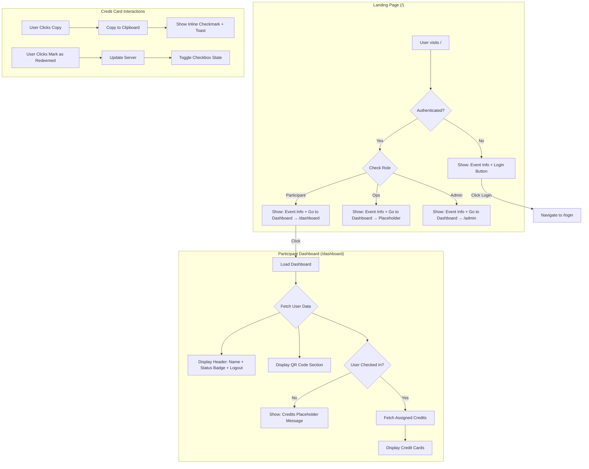
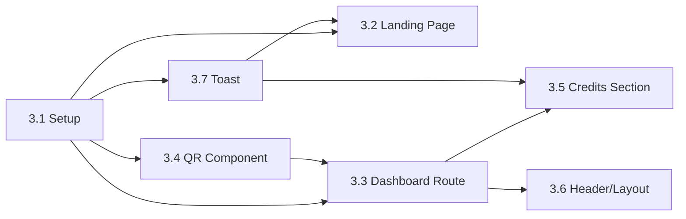

# Phase 3: Participant Dashboard - Development Plan

**Created:** December 2, 2025  
**Phase:** 3 of 8  
**Dependencies:** Phase 1 (Schema & Auth), Phase 2 (Admin Import)  
**Reference:** [v1-development-plan.md](../../../v1-development-plan.md), [qr-code-logo-research.md](./qr-code-logo-research.md)

---

## Feature Overview

Build the participant-facing dashboard where logged-in users can view their QR code and assigned credits. Also update the landing page to show event information with role-based navigation.

**Key Deliverables:**
- Landing page (`/`) with event info and role-based "Go to Dashboard" button
- Participant dashboard (`/dashboard`) with QR code display and credits list
- QR code component with embedded Cursor logo using `qr-code-styling`
- Toast notification system for user feedback
- Credit card component with copy functionality and redemption status

---

## Flow Visualization

---

## Relevant Files

### Existing Files (Reference/Modify)
| File | Purpose |
|------|---------|
| `apps/web/src/routes/index.tsx` | Landing page - needs update |
| `apps/web/src/routes/login.tsx` | Login page - reference for auth patterns |
| `apps/web/src/routes/admin.tsx` | Admin layout - reference for protected routes |
| `apps/web/src/apis/auth.ts` | Auth server functions - reuse `getServerSession`, `requireSession` |
| `packages/core/src/auth/schema.ts` | User schema with `status`, `qrCodeValue` fields |
| `packages/core/src/business.server/events/schemas/codes.sql.ts` | Codes schema |
| `packages/core/src/business.server/events/schemas/credit-types.sql.ts` | Credit types schema |
| `packages/core/src/config/constant.ts` | Enums for status, roles |

### New Files to Create
| File | Purpose |
|------|---------|
| `apps/web/src/routes/dashboard.tsx` | Participant dashboard route |
| `apps/web/src/apis/participant/dashboard.ts` | Server functions for participant data |
| `packages/ui/src/components/sonner.tsx` | Toast notification component (shadcn/sonner) |
| `packages/ui/src/components/qr-code-display.tsx` | QR code with logo component |
| `apps/web/public/cursor-logo.png` | Cursor logo asset for QR embedding (already exists) |
| `packages/core/src/config/qr.ts` | Shared QR styling config |

---

## References and Resources

| Resource | URL | Purpose |
|----------|-----|---------|
| qr-code-styling docs | https://github.com/kozakdenys/qr-code-styling | QR code library with logo support |
| Shadcn Toast | https://ui.shadcn.com/docs/components/toast | Toast notification component |
| TanStack Router Protected Routes | https://tanstack.com/router/latest/docs/framework/react/guide/authenticated-routes | Route guards |
| Clipboard API | https://developer.mozilla.org/en-US/docs/Web/API/Clipboard/writeText | Copy to clipboard |

---

## Task Breakdown

### Phase 3.1: Setup and Dependencies

#### Task 3.1.1: Install Required Packages

**Description:** Add QR code library and toast dependencies to the project.

**Relevant files:** `apps/web/package.json`, `packages/ui/package.json`

- [x] Install `qr-code-styling` in `apps/web` for frontend QR rendering
- [x] Run `pnpm ui:add toast` from root to add shadcn toast component to `packages/ui`
- [x] Verify toast exports from `packages/ui`

#### Task 3.1.2: Add Logo Asset

**Description:** Add Cursor logo for QR code embedding.

**Relevant files:** `apps/web/public/`

- [x] Add `cursor-logo.png` to `apps/web/public/` (square, min 200x200px, PNG format)
- [x] Verify logo is accessible at `/cursor-logo.png` when dev server runs

#### Task 3.1.3: Create Shared QR Config

**Description:** Create shared configuration for consistent QR styling across frontend and backend.

**Relevant files:** `packages/core/src/config/qr.ts`

- [x] Create `qr-config.ts` with `QR_STYLE_OPTIONS` object containing dot styles, colors, corners, error correction level 'H'
- [x] Create `getLogoUrl(isServer: boolean)` helper that returns relative path for frontend, absolute URL for backend
- [x] Export types for QR options

**Dependencies:** Requires `APP_BASE_URL` environment variable

---

### Phase 3.2: Landing Page Update

#### Task 3.2.1: Update Landing Page Route

**Description:** Modify the root route to show event information with role-based navigation.

**Relevant files:** `apps/web/src/routes/index.tsx`

- [x] Add `beforeLoad` to fetch session (non-blocking, returns null if not authenticated)
- [x] Pass session to component via route context
- [x] Display event info: "Cursor x Anthropic MY Hackathon", "December 6-7, 2025", "Monash University Malaysia, Level 2"
- [x] Conditional button: "Login" (unauthenticated) or "Go to Dashboard" (authenticated)
- [x] Role-based navigation: Participant → `/dashboard`, Admin → `/admin`, Ops → show "Coming Soon" toast
- [x] Mobile-responsive layout with centered content

---

### Phase 3.3: Participant Dashboard Route

#### Task 3.3.1: Create Dashboard Route with Auth Guard

**Description:** Create protected route for participant dashboard with session validation.

**Relevant files:** `apps/web/src/routes/dashboard.tsx`

- [x] Create route at `/dashboard` using `createFileRoute`
- [x] Add `beforeLoad` that calls `requireSession()` - redirects to `/login` if not authenticated
- [x] Return user data in route context for component consumption
- [x] Create basic layout structure: header, QR section, credits section

#### Task 3.3.2: Create Dashboard Server Functions

**Description:** Create server functions to fetch participant-specific data.

**Relevant files:** `apps/web/src/apis/participant/dashboard.ts`

- [x] Create `getParticipantDashboard` server function that returns: user info (name, email, status, qrCodeValue), assigned credits with credit type details
- [x] Use `requireSession()` for auth
- [x] Join codes with credit_types table, filter by `assignedTo = userId`
- [x] Order credits by `creditType.displayOrder`
- [x] Create `markCreditRedeemed` server function to toggle `redeemedAt` timestamp on codes table

---

### Phase 3.4: QR Code Display Component

#### Task 3.4.1: Create QR Code Component

**Description:** Build reusable QR code component with embedded Cursor logo using `qr-code-styling`.

**Relevant files:** `packages/ui/src/components/qr-code-display.tsx`

- [x] Create `QRCodeDisplay` component accepting `value: string` and optional `size?: number` props
- [x] Use `qr-code-styling` library with shared config from `qr-config.ts`
- [x] Render QR as canvas/SVG with embedded logo
- [x] Use `useEffect` to initialize QRCodeStyling instance and append to container ref
- [x] Handle loading state while QR generates
- [x] Set minimum size to 300x300px as per spec
- [x] Export from `packages/ui`

#### Task 3.4.2: Integrate QR Display in Dashboard

**Description:** Add QR code section to participant dashboard.

**Relevant files:** `apps/web/src/routes/dashboard.tsx`

- [x] Import `QRCodeDisplay` component
- [x] Display QR code using user's `qrCodeValue` from server data
- [x] Add instructional text: "Show this at registration desk" and "Show at food stations"
- [x] Add "This QR never expires" message below QR
- [x] Style as card with appropriate padding and centering

---

### Phase 3.5: Credits Section

#### Task 3.5.1: Create Credit Card Component

**Description:** Build component to display individual credit with copy and redeem functionality.

**Relevant files:** `apps/web/src/routes/dashboard.tsx` (inline or separate component file)

- [x] Create `CreditCard` component displaying: credit type display name, code value (with copy button), redeem URL (as link), instructions (plain text, expandable), "Mark as Redeemed" checkbox
- [x] Implement copy button using Clipboard API
- [x] On copy: change icon to checkmark for 2 seconds AND show toast "Copied to clipboard!"
- [x] Checkbox triggers `markCreditRedeemed` mutation
- [x] Show `redeemedAt` timestamp if already redeemed
- [x] Style with clear visual hierarchy, mobile-friendly tap targets

#### Task 3.5.2: Build Credits List Section

**Description:** Display list of assigned credits with filtering.

**Relevant files:** `apps/web/src/routes/dashboard.tsx`

- [x] Fetch credits via TanStack Query using `getParticipantDashboard`
- [x] If user status is `registered` (not checked in): show placeholder "Your credits will appear after check-in"
- [x] If user status is `checked_in`: display credit cards
- [x] Add filter tabs: All | Redeemed | Pending (local state, not URL)
- [x] Show credit count in section header
- [x] Handle empty states gracefully

---

### Phase 3.6: Dashboard Header and Layout

#### Task 3.6.1: Build Dashboard Header

**Description:** Create header with user info, status badge, and logout.

**Relevant files:** `apps/web/src/routes/dashboard.tsx`

- [x] Display welcome message with user name
- [x] Show status badge: "Registered" (gray) or "Checked In" (green) based on `status` field
- [x] Add logout button that calls `authClient.signOut()` and redirects to `/`
- [x] Mobile-responsive: stack vertically on small screens

#### Task 3.6.2: Mobile-First Responsive Layout

**Description:** Ensure dashboard is optimized for mobile devices.

**Relevant files:** `apps/web/src/routes/dashboard.tsx`

- [x] Single column layout on mobile
- [x] QR code section full-width with centered QR
- [x] Credit cards stack vertically
- [x] Adequate touch targets (min 44x44px)
- [ ] Test on various viewport sizes

---

### Phase 3.7: Toast Integration

#### Task 3.7.1: Setup Toast Provider

**Description:** Add toast provider to app root for notifications.

**Relevant files:** `apps/web/src/routes/__root.tsx`, `packages/ui/`

- [x] After running `pnpm ui:add toast`, verify `toast.tsx`, `toaster.tsx`, and `use-toast.ts` exist in UI package
- [x] Export toast components and hook from `packages/ui`
- [x] Add `<Toaster />` to root layout in `__root.tsx`
- [x] Test toast appears correctly

#### Task 3.7.2: Implement Toast Notifications

**Description:** Add toast feedback for user actions.

**Relevant files:** `apps/web/src/routes/dashboard.tsx`, `apps/web/src/routes/index.tsx`

- [x] Copy action: show success toast "Copied to clipboard!"
- [x] Mark redeemed action: show success toast "Marked as redeemed"
- [x] Ops "Go to Dashboard" click: show info toast "Ops dashboard coming soon"
- [x] Error states: show error toast with message

---

## Dependencies

- Phase 3.1 (Setup) must complete before all other tasks
- Phase 3.3 (Dashboard Route) depends on 3.1
- Phase 3.4 (QR Component) depends on 3.1, used by 3.3
- Phase 3.5 (Credits) depends on 3.3
- Phase 3.6 (Header/Layout) depends on 3.3
- Phase 3.7 (Toast) depends on 3.1, used by 3.2 and 3.5

---

## Potential Risks / Edge Cases

| Risk | Mitigation |
|------|------------|
| QR code not scanning | Use error correction 'H', test with multiple devices (iOS Camera, Android), ensure adequate size (300px+) |
| User has no `qrCodeValue` | Should not happen (generated on import), but handle gracefully with error message |
| User checked in but no credits assigned | Code pool may have exhausted - show message "No credits available" |
| Copy fails on older browsers | Clipboard API has good support, but wrap in try-catch and show fallback toast |
| `qr-code-styling` SSR issues | Library is client-only, use dynamic import or ensure component only renders on client |
| Toast not appearing | Verify `<Toaster />` is in root layout and hook is imported correctly |
| Large number of credits | Unlikely (max 6 types), but use virtualization if needed |
| Session expires while on dashboard | TanStack Query will refetch, `requireSession` will redirect to login |

---

## Testing Checklist

### Landing Page
- [ ] Unauthenticated user sees event info and "Login" button
- [ ] Clicking "Login" navigates to `/login`
- [ ] Authenticated participant sees "Go to Dashboard" button
- [ ] Clicking "Go to Dashboard" as participant navigates to `/dashboard`
- [ ] Authenticated admin sees "Go to Dashboard" → navigates to `/admin`
- [ ] Authenticated ops sees "Go to Dashboard" → shows "Coming soon" toast
- [ ] Page is responsive on mobile

### Dashboard Access
- [ ] Unauthenticated user visiting `/dashboard` redirects to `/login`
- [ ] After login, user lands on `/dashboard`
- [ ] User name displays correctly in header
- [ ] Logout button works and redirects to `/`

### QR Code Display
- [ ] QR code renders with Cursor logo embedded
- [ ] QR code is scannable (test with phone camera)
- [ ] QR size is at least 300x300px
- [ ] Instructions text displays below QR
- [ ] "This QR never expires" message shows

### Credits Section (Pre-Check-in)
- [ ] User with status `registered` sees placeholder message
- [ ] Placeholder message: "Your credits will appear after check-in"

### Credits Section (Post-Check-in)
- [ ] User with status `checked_in` sees credit cards
- [ ] Credit card shows: display name, code value, redeem URL, instructions
- [ ] Copy button copies code to clipboard
- [ ] Copy button shows checkmark for 2 seconds after click
- [ ] Toast appears: "Copied to clipboard!"
- [ ] "Mark as Redeemed" checkbox works
- [ ] Checking box shows toast: "Marked as redeemed"
- [ ] Filter tabs (All/Redeemed/Pending) filter correctly
- [ ] Instructions expand/collapse on click

### Mobile Responsiveness
- [ ] Dashboard renders correctly on 375px width (iPhone SE)
- [ ] Dashboard renders correctly on 390px width (iPhone 14)
- [ ] Touch targets are adequate size
- [ ] No horizontal scroll

### Error States
- [ ] Network error shows appropriate message
- [ ] Loading states display correctly

---

## Notes

- **Event Info Hardcoded:** Event name, date, and location are hardcoded for this specific event. Future events would require config changes.
- **Profile Section Deferred:** Editable profile (name change) is deferred to a later phase.
- **Pre-Check-in Date Message Deferred:** "Check-in opens Dec 6, 9:00 AM" message is not in scope for this phase.
- **QR Code Consistency:** Using `qr-code-styling` for both frontend and backend (emails) ensures identical appearance.
- **Logo Asset:** Cursor logo must be added to `apps/web/public/cursor-logo.png` before QR component works.

---

## Implementation Notes (Phase 3.1 & 3.2)

**Date:** December 3, 2025

### Deviations from Plan

1. **Toast Library Change:** The plan specified `pnpm ui:add toast` which expected the deprecated shadcn toast component. The new shadcn registry uses `sonner` instead. Installed `sonner` and created `packages/ui/src/components/sonner.tsx`.

2. **Sonner Simplification:** The generated sonner component included `next-themes` dependency which isn't applicable to TanStack Start. Simplified to use a static `light` theme.

3. **Navigation to /dashboard:** Since the `/dashboard` route doesn't exist yet (Phase 3.3), used `window.location.href` for participant navigation to avoid TypeScript route type errors. This will be updated to `navigate()` once the route is created.

### Files Created/Modified

**Created:**
- `packages/ui/src/components/sonner.tsx` - Toast component using Sonner
- `packages/core/src/business.server/events/qr-config.ts` - Shared QR styling configuration

**Modified:**
- `apps/web/src/routes/__root.tsx` - Added Toaster provider
- `apps/web/src/routes/index.tsx` - Landing page with event info and role-based navigation
- `apps/web/package.json` - Added `qr-code-styling` and `sonner` dependencies
- `packages/ui/package.json` - Added `sonner` dependency (removed unused `next-themes`)

### Dependencies Added

- `qr-code-styling` in apps/web - For frontend QR code rendering with logo
- `sonner` in apps/web and packages/ui - Toast notifications

---

## Implementation Notes (Phase 3.3-3.7)

**Date:** December 3, 2025

### Files Created

| File | Purpose |
|------|---------|
| `apps/web/src/routes/dashboard.tsx` | Participant dashboard with QR code, credits, header |
| `apps/web/src/apis/participant/dashboard.ts` | Server functions: `getParticipantDashboard`, `markCreditRedeemed` |
| `apps/web/src/components/qr-code-display.tsx` | QR code component using `qr-code-styling` |

### Files Modified

| File | Changes |
|------|---------|
| `apps/web/src/apis/auth.ts` | Refactored to use internal functions for session logic |
| `apps/web/src/routes/index.tsx` | Updated to use `navigate()` for dashboard route |
| `packages/core/src/config/qr.ts` | Moved from events folder, removed env import for client compatibility |

### Key Implementation Details

1. **QR Config Client Compatibility:** Removed top-level `env` import from `qr.ts` which caused client-side errors. `getLogoUrl()` now takes optional `baseUrl` parameter.

2. **Server Function Refactoring:** Extracted `getSessionFromRequest()` and `requireSessionInternal()` as internal functions to avoid server functions calling other server functions (which loses HTTP context).

3. **Credits Display Logic:**
   - If user status is `registered`: Shows "Your credits will appear after check-in"
   - If user status is `checked_in`: Shows credit cards with filter tabs

4. **Credit Card Features:**
   - Copy button with checkmark feedback (2 seconds)
   - Expandable instructions
   - Mark as redeemed checkbox (persisted to DB)
   - Redeem URL as external link

### Status: COMPLETE

All Phase 3 tasks are implemented and tested.

