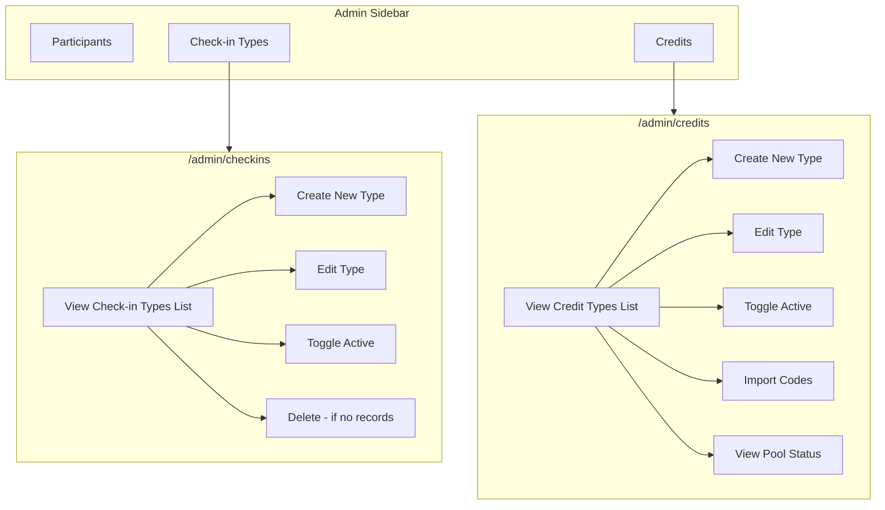
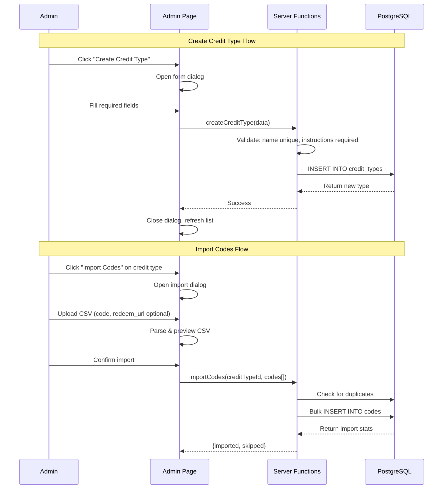

# Phase 4: Admin - Credits & Check-in Types Management Plan

**Status:** Implementation Complete  
**Estimated Effort:** 1 day  
**Dependencies:** Phase 1 (Schema & Auth)

---

## Feature Overview

Enable administrators to:
1. **Check-in Types Management** (`/admin/checkins`) - Create and manage check-in categories (attendance, meals) used by ops in Phase 5/6
2. **Credit Types Management** (`/admin/credits`) - Create and manage sponsor credit types, import codes, monitor pool status

This is a prerequisite for Phase 5 (Registration Check-in) where check-in types are selected and codes are assigned.

**Scope:**
- Check-in type CRUD operations (create, edit, toggle active, delete if no records)
- Credit type CRUD operations (create, edit, toggle active - no delete)
- Bulk code import per credit type
- Pool status visualization
- Admin-only access

**Out of Scope:**
- Actual check-in processing (Phase 5/6)
- Code assignment to participants (Phase 5)
- Redemption tracking by participants (already in Phase 3)

---

## Key Decisions

| Decision | Choice | Rationale |
|----------|--------|-----------|
| `codes.redeemUrl` | Optional | Some sponsors may not have a specific redeem URL |
| `emailInstructions` / `webInstructions` | Required | Admin must provide instructions for each credit type |
| Page structure | Separate pages | `/admin/checkins` and `/admin/credits` |
| Credit type deletion | Allowed if no assigned codes | Can delete only if no codes have been assigned to participants |
| Check-in type deletion | Allowed if no records | Can delete only if no checkin_records exist |
| Distribution type | Unique or Universal | Supports both unique codes (CSV import) and universal codes (same code for all) |
| Code normalization | Uppercase | All code values are normalized to uppercase on import and creation |

---

## Flow Visualization





---

## Universal Code Distribution

Credit types support two distribution modes:

### Unique Distribution (default)
- Each participant receives a different code
- Codes are imported via CSV
- Import button available in actions column

### Universal Distribution
- All participants receive the same code
- Admin enters code, redeem URL, and quantity during creation
- System auto-generates N identical code records
- No CSV import needed (import button hidden)
- Codes are still individually assigned to participants for tracking

**Schema additions:**
- `credit_types.distributionType`: 'unique' | 'universal'
- `credit_types.universalCode`: The shared code value (nullable)
- `credit_types.universalRedeemUrl`: The shared redeem URL (nullable)

**Code normalization:**
- All code values are converted to uppercase on import/creation
- Applied in both CSV parser and server functions

---

## Relevant Files

### Existing Files (Reference/Extend)

| File | Role |
|------|------|
| `packages/core/src/business.server/events/schemas/checkin-types.sql.ts` | Check-in types schema |
| `packages/core/src/business.server/events/schemas/checkin-records.sql.ts` | Check-in records schema (for delete validation) |
| `packages/core/src/business.server/events/schemas/credit-types.sql.ts` | Credit types schema |
| `packages/core/src/business.server/events/schemas/codes.sql.ts` | Codes schema |
| `packages/core/src/config/constant.ts` | Enums: `CheckinTypeCategoryCodes`, `CodeStatusCodes` |
| `apps/web/src/routes/admin.tsx` | Admin layout - add 2 nav items |
| `apps/web/src/routes/admin/participants.tsx` | Reference for UI patterns |
| `apps/web/src/apis/admin/participants.ts` | Reference for server function patterns |
| `apps/web/src/utils/csv-parser.ts` | Reference for CSV parsing |

### New Files to Create

| File | Purpose |
|------|---------|
| `apps/web/src/routes/admin/checkins.tsx` | Check-in Types management page |
| `apps/web/src/routes/admin/credits.tsx` | Credit Types management page |
| `apps/web/src/apis/admin/checkins.ts` | Server functions for check-in types |
| `apps/web/src/apis/admin/credits.ts` | Server functions for credit types |
| `packages/ui/src/components/textarea.tsx` | Textarea component (via Shadcn) |

---

## Task Breakdown

### Phase A: Backend - Server Functions

#### Task A.1: Check-in Types Server Functions

**Description:** Implement server functions for check-in type CRUD operations.

**Relevant files:** `apps/web/src/apis/admin/checkins.ts`

- [x] Create `listCheckinTypes` - Fetch all check-in types ordered by displayOrder
- [x] Create `createCheckinType` - Insert new check-in type with validation (unique name)
- [x] Create `updateCheckinType` - Update existing check-in type fields
- [x] Create `toggleCheckinTypeActive` - Toggle the `isActive` field
- [x] Create `deleteCheckinType` - Delete type only if no checkin_records exist (check count first, return error if records exist)

**Validation:**
- `name`: required, unique
- `type`: required, enum (attendance | meal)
- `description`: optional
- `displayOrder`: required, number
- `isActive`: boolean, default true

#### Task A.2: Credit Types Server Functions

**Description:** Implement server functions for credit type CRUD and code import operations.

**Relevant files:** `apps/web/src/apis/admin/credits.ts`

- [x] Create `listCreditTypes` - Fetch all credit types with pool statistics (total, assigned, remaining counts)
- [x] Create `createCreditType` - Insert new credit type with validation, supports universal code auto-generation
- [x] Create `updateCreditType` - Update existing credit type fields (except name and distributionType)
- [x] Create `toggleCreditTypeActive` - Toggle the `isActive` field
- [x] Create `deleteCreditType` - Delete type only if no codes have been assigned
- [x] Create `importCodes` - Bulk import codes for a credit type with duplicate detection and uppercase normalization

**Validation:**
- `name`: required, unique, lowercase no spaces (internal key)
- `displayName`: required
- `emailInstructions`: **required**
- `webInstructions`: **required**
- `displayOrder`: required, number
- `iconUrl`: optional
- `isActive`: boolean, default true
- `distributionType`: 'unique' (default) or 'universal'
- `universalCode`: required if distributionType is 'universal' (auto-uppercased)
- `universalRedeemUrl`: optional
- `universalQuantity`: required if distributionType is 'universal'

**Import codes validation:**
- `codeValue`: required (auto-uppercased)
- `redeemUrl`: **optional**

**Pool stats query pattern:**

```sql
SELECT 
  credit_type_id,
  COUNT(*) as total,
  COUNT(*) FILTER (WHERE status != 'unassigned') as assigned,
  COUNT(*) FILTER (WHERE status = 'unassigned') as remaining
FROM codes
GROUP BY credit_type_id
```

---

### Phase B: UI Components & Navigation

#### Task B.1: Add Textarea Component

**Description:** Add Shadcn textarea component to the UI package.

**Relevant files:** `packages/ui/src/components/textarea.tsx`

- [x] Run `pnpm ui:add textarea` to add Shadcn textarea component
- [x] Verify export from `@base/ui/components/textarea`

#### Task B.2: Add Navigation Items

**Description:** Add two navigation items to admin sidebar.

**Relevant files:** `apps/web/src/routes/admin.tsx`

- [x] Add "Check-in Types" nav item with appropriate icon (e.g., `ClipboardList`) pointing to `/admin/checkins`
- [x] Add "Credits" nav item with appropriate icon (e.g., `Gift`) pointing to `/admin/credits`

---

### Phase C: Check-in Types Page

#### Task C.1: Check-in Types List Page

**Description:** Create the check-in types management page.

**Relevant files:** `apps/web/src/routes/admin/checkins.tsx`

- [x] Create route file with `createFileRoute('/admin/checkins')`
- [x] Implement table with columns: Name, Type (attendance/meal badge), Description, Display Order, Status (active badge), Actions
- [x] Wire up TanStack Query for data fetching with `listCheckinTypes`
- [x] Order by displayOrder

#### Task C.2: Create Check-in Type Dialog

**Description:** Implement dialog for creating new check-in types.

**Relevant files:** `apps/web/src/routes/admin/checkins.tsx`

- [x] Create form dialog with fields: Name (text), Type (select: attendance/meal), Description (optional textarea), Display Order (number), Active (checkbox)
- [x] Add form validation
- [x] Wire up mutation with `createCheckinType` server function
- [x] Handle duplicate name error

#### Task C.3: Edit Check-in Type Dialog

**Description:** Implement dialog for editing existing check-in types.

**Relevant files:** `apps/web/src/routes/admin/checkins.tsx`

- [x] Reuse form structure from create dialog, pre-populate with existing values
- [x] Wire up mutation with `updateCheckinType` server function

#### Task C.4: Toggle Active & Delete Actions

**Description:** Implement toggle and delete actions.

**Relevant files:** `apps/web/src/routes/admin/checkins.tsx`

- [x] Add toggle active button in actions column
- [x] Add delete button in actions column
- [x] Show confirmation dialog before delete
- [x] Wire up mutations
- [x] Handle "cannot delete - records exist" error with clear message

---

### Phase D: Credit Types Page

#### Task D.1: Credit Types List Page

**Description:** Create the credit types management page with pool status.

**Relevant files:** `apps/web/src/routes/admin/credits.tsx`

- [x] Create route file with `createFileRoute('/admin/credits')`
- [x] Implement table with columns: Display Name, Name (key), Display Order, Status (active badge), Pool Status (visual indicator), Actions
- [x] Wire up TanStack Query for data fetching with `listCreditTypes`
- [x] Order by displayOrder

#### Task D.2: Pool Status Component

**Description:** Create component for displaying code pool status with visual indicators.

**Relevant files:** `apps/web/src/routes/admin/credits.tsx`

- [x] Create `PoolStatus` component showing: Total / Assigned / Remaining
- [x] Implement color-coded progress bar (green >50%, yellow 10-50%, red <10%)
- [x] Handle edge case of zero total codes (show "No codes")

#### Task D.3: Create Credit Type Dialog

**Description:** Implement dialog for creating new credit types.

**Relevant files:** `apps/web/src/routes/admin/credits.tsx`

- [x] Create form dialog with fields:
  - Name (text, internal key - lowercase, no spaces)
  - Display Name (text, required)
  - Distribution Type (radio: Unique / Universal)
  - Universal Code (text, required if universal, auto-uppercased)
  - Universal Redeem URL (text, optional if universal)
  - Universal Quantity (number, required if universal)
  - Email Instructions (textarea, required)
  - Web Instructions (textarea, required)
  - Display Order (number)
  - Icon URL (text, optional)
  - Active (checkbox)
- [x] Add form validation (name pattern, required fields, universal fields conditional)
- [x] Wire up mutation with `createCreditType` server function
- [x] Handle duplicate name error

#### Task D.4: Edit Credit Type Dialog

**Description:** Implement dialog for editing existing credit types.

**Relevant files:** `apps/web/src/routes/admin/credits.tsx`

- [x] Reuse form structure from create dialog, pre-populate with existing values
- [x] **Disable name field** (cannot change internal key after creation)
- [x] Wire up mutation with `updateCreditType` server function

#### Task D.5: Toggle Active & Delete Actions

**Description:** Implement toggle active and delete actions for credit types.

**Relevant files:** `apps/web/src/routes/admin/credits.tsx`

- [x] Add toggle active button in actions column
- [x] Wire up mutation with `toggleCreditTypeActive` server function
- [x] Add delete button in actions column
- [x] Show confirmation dialog before delete
- [x] Wire up mutation with `deleteCreditType` server function
- [x] Handle "cannot delete - codes assigned" error with clear message

---

### Phase E: Code Import Feature

#### Task E.1: Code Import Dialog

**Description:** Implement CSV import dialog for codes.

**Relevant files:** `apps/web/src/routes/admin/credits.tsx`

- [x] Create import dialog triggered from credit type row actions ("Import Codes" button)
- [x] Reuse `FileUpload` component pattern from participants import
- [x] Display expected CSV format: `code,redeem_url` (redeem_url optional)
- [x] Show credit type name in dialog title

#### Task E.2: CSV Parsing for Codes

**Description:** Implement client-side CSV parsing for codes.

**Relevant files:** `apps/web/src/utils/csv-parser.ts` (extend existing)

- [x] Create `parseCodesCSV` function
- [x] Validate: `code` column required, `redeem_url` column optional
- [x] Detect duplicates within the uploaded file
- [x] Return parsed rows with validation status

#### Task E.3: Import Preview and Confirmation

**Description:** Implement preview and import flow.

**Relevant files:** `apps/web/src/routes/admin/credits.tsx`

- [x] Display preview table showing first N rows with validation status
- [x] Show count of valid/invalid rows
- [x] Implement confirm import action calling `importCodes` server function
- [x] Display import result (imported count, skipped rows with reasons)
- [x] Add "Download Skipped" button for skipped rows CSV
- [x] Refresh pool status after successful import

---

## Dependencies

```
Phase A (Backend) ──┬──> Phase B (UI/Nav) - can run in parallel
                    │
                    ├──> Phase C (Check-in Types Page) - requires A.1, B
                    │
                    └──> Phase D (Credit Types Page) - requires A.2, B
                              │
                              └──> Phase E (Code Import) - requires D
```

---

## Potential Risks / Edge Cases

| Risk | Mitigation |
|------|------------|
| Deleting check-in type with records | Check count before delete, return clear error message |
| Duplicate check-in type name | Database unique constraint + clear error message |
| Duplicate credit type name | Database unique constraint + clear error message |
| Duplicate codes in same CSV | Client-side detection before import |
| Duplicate codes in database | Skip and report in import result |
| Large CSV import (~1k codes) | Batch insert of 100 is sufficient |
| Empty CSV | Client-side validation with clear error |
| CSV missing required column | Client-side validation with clear error |
| Editing credit type name | Disable name field in edit dialog |

---

## Testing Checklist

### Check-in Type Management (`/admin/checkins`)

- [ ] Can create new check-in type with all fields
- [ ] Cannot create check-in type with duplicate name
- [ ] Can edit existing check-in type
- [ ] Can toggle check-in type active/inactive
- [ ] Can delete check-in type with no records
- [ ] Cannot delete check-in type with existing records (shows clear error)
- [ ] Inactive check-in types show visual indicator (dimmed or badge)
- [ ] Check-in types sorted by display order
- [ ] Type badges show correctly (attendance vs meal)

### Credit Type Management (`/admin/credits`)

- [ ] Can create new credit type with all required fields (unique distribution)
- [ ] Can create new credit type with universal distribution
- [ ] Universal code auto-generates N code records
- [ ] Cannot create without emailInstructions or webInstructions (validation error)
- [ ] Cannot create credit type with duplicate name
- [ ] Can edit existing credit type (except name and distributionType)
- [ ] Name field is disabled in edit dialog
- [ ] Distribution type field is disabled in edit dialog
- [ ] Can toggle credit type active/inactive
- [ ] Can delete credit type with no assigned codes
- [ ] Cannot delete credit type with assigned codes (shows clear error)
- [ ] Inactive credit types show visual indicator
- [ ] Credit types sorted by display order
- [ ] Import button only shown for unique distribution types

### Code Import

- [ ] Can upload CSV file with code column only (redeem_url optional)
- [ ] Can upload CSV with both code and redeem_url columns
- [ ] Preview shows first N rows with validation status
- [ ] Missing code value marked as invalid
- [ ] Duplicate codes within CSV detected and shown
- [ ] Import skips codes that already exist in database
- [ ] Import result shows counts (imported/skipped)
- [ ] Can download skipped rows CSV
- [ ] Pool status updates after successful import
- [ ] Code values are normalized to uppercase on import
- [ ] Import button not shown for universal distribution types

### Pool Status Display

- [ ] Shows correct total/assigned/remaining counts
- [ ] Green indicator when >50% remaining
- [ ] Yellow indicator when 10-50% remaining
- [ ] Red indicator when <10% remaining
- [ ] Shows "No codes" for zero total

### Navigation

- [ ] "Check-in Types" nav item appears in admin sidebar
- [ ] "Credits" nav item appears in admin sidebar
- [ ] Both pages load without errors
- [ ] Non-admin users cannot access either page

---

## Notes

**5 Check-in Types to be created:**

| Name | Type | Display Order |
|------|------|---------------|
| Day 1 Attendance | attendance | 1 |
| Day 1 Lunch | meal | 2 |
| Day 1 Dinner | meal | 3 |
| Day 2 Attendance | attendance | 4 |
| Day 2 Breakfast | meal | 5 |

**6 Credit Types to be created:**

| Name | Display Name | Display Order |
|------|--------------|---------------|
| `cursor` | Cursor Pro Credits (50 credits) | 1 |
| `anthropic` | Anthropic API Credits ($25) | 2 |
| `elevenlabs` | ElevenLabs Voice AI (6 month Scale tier) | 3 |
| `leanmcp` | LeanMCP Pro (1 week trial) | 4 |
| `mobbin` | Mobbin Pro (3 month subscription) | 5 |
| `vercel` | Vercel Deployment Credits (5000 credits) | 6 |

**CSV Format for Codes:**

```csv
code,redeem_url
ABC123XYZ,https://cursor.com/redeem
DEF456ABC,
GHI789DEF,https://cursor.com/redeem
```

Note: `redeem_url` is optional - empty values are allowed.

**Field requirements summary:**
- `emailInstructions`: Required - brief text for emails
- `webInstructions`: Required - plain text for dashboard display
- `redeemUrl` (per code): Optional - some sponsors may not have a specific URL
