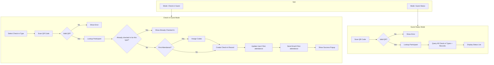
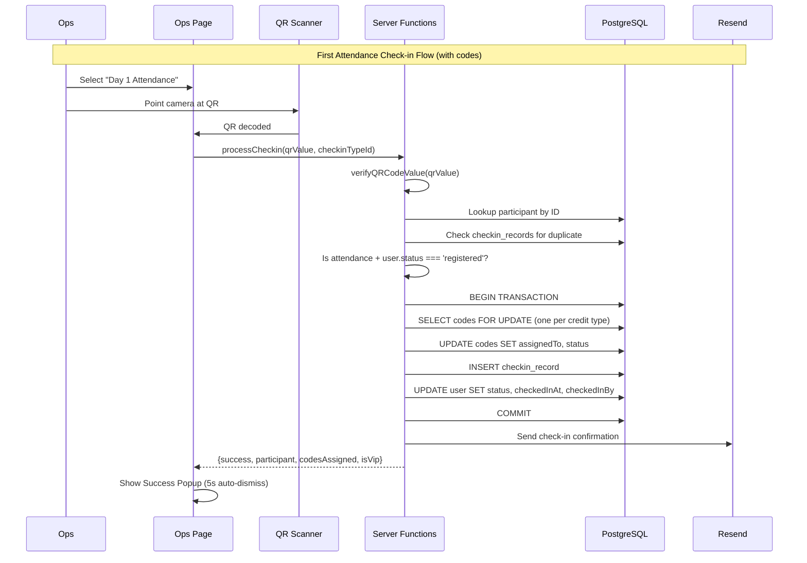

# Phase 5 & 6: Ops Check-in System Plan

**Status:** Complete (All Phases A-G Complete)  
**Estimated Effort:** 2 days  
**Dependencies:** Phase 1 (Schema), Phase 2 (Admin Import), Phase 4 (Credits & Check-in Types)

---

## Feature Overview

Build the ops check-in system that enables operations volunteers to:
1. **Check-in Guest** - Scan participant QR, select check-in type, process check-in
2. **Guest Status** - Scan participant QR, view all check-in statuses

**Scope:**
- Ops route layout with role guard (ops + admin access)
- QR scanner component using html5-qrcode
- Check-in type selector (fetched from database)
- QR validation and participant lookup
- Check-in processing with duplicate prevention
- Code assignment on first attendance check-in
- Check-in confirmation email with credits list
- VIP badge display (no codes assigned)
- Real-time counters per check-in type
- Recent scans history (personalized to current ops)
- Success/error feedback with auto-dismiss

**Out of Scope:**
- Manual participant lookup by email (Phase 8)
- Offline mode / queue (Phase 2 features per v1-doc)
- Bulk scan mode (Phase 2 features)

---

## Key Decisions

| Decision | Choice | Rationale |
|----------|--------|-----------|
| QR scanner library | html5-qrcode | Mentioned in v1-doc, well-documented, supports torch toggle |
| Code assignment trigger | First attendance check-in | When `checkin_type.type === 'attendance'` AND `user.status === 'registered'` |
| Meal check-in validation | No requirement | Anyone can check in for meals regardless of attendance status |
| Recent scans | Personalized (current ops only) | Query from `checkin_records` filtered by `checkedInBy` |
| Success popup | Auto-dismiss 5s + manual close | Fast flow for high-volume check-ins |
| Page structure | `/ops` with mode toggle | Single page with two modes: Check-in Guest / Guest Status |

---

## Flow Visualization





---

## UI Mockups (ASCII)

### Mode Selection Header

```
┌─────────────────────────────────────────────────────┐
│  Ops Dashboard                         [Logout]     │
├─────────────────────────────────────────────────────┤
│                                                     │
│  ┌─────────────────┐  ┌─────────────────┐          │
│  │ ✓ Check-in     │  │   Guest Status  │          │
│  │   Guest        │  │                 │          │
│  └─────────────────┘  └─────────────────┘          │
│                                                     │
```

### Mode 1: Check-in Guest

```
┌─────────────────────────────────────────────────────┐
│  Ops Dashboard                         [Logout]     │
├─────────────────────────────────────────────────────┤
│  [✓ Check-in Guest]  [Guest Status]                 │
├─────────────────────────────────────────────────────┤
│                                                     │
│  Select Check-in Type:                              │
│  ┌─────────────────────────────────────────────┐   │
│  │ (•) Day 1 Attendance                        │   │
│  │ ( ) Day 1 Lunch                             │   │
│  │ ( ) Day 1 Dinner                            │   │
│  │ ( ) Day 2 Attendance                        │   │
│  │ ( ) Day 2 Breakfast                         │   │
│  └─────────────────────────────────────────────┘   │
│                                                     │
│  ┌─────────────────────────────────────────────┐   │
│  │                                             │   │
│  │           [ Camera Viewfinder ]             │   │
│  │                                             │   │
│  │              ┌─────────┐                    │   │
│  │              │ ▢▢▢▢▢▢▢ │                    │   │
│  │              │ ▢     ▢ │  Point camera at   │   │
│  │              │ ▢ QR  ▢ │  participant's     │   │
│  │              │ ▢     ▢ │  QR code           │   │
│  │              │ ▢▢▢▢▢▢▢ │                    │   │
│  │              └─────────┘                    │   │
│  │                                             │   │
│  │                    [🔦 Torch]               │   │
│  └─────────────────────────────────────────────┘   │
│                                                     │
├─────────────────────────────────────────────────────┤
│  ✓ 347 checked in for Day 1 Attendance             │
├─────────────────────────────────────────────────────┤
│  Recent Scans:                                      │
│  • John Doe ✓ 10:34 AM                             │
│  • Sarah Lee ✓ 10:32 AM                            │
│  • Mike Chen ⚠️ Already checked in                  │
│  • Alex Wong ✓ 10:28 AM                            │
│  • Lisa Tan ✓ 10:25 AM                             │
└─────────────────────────────────────────────────────┘
```

### Success Popup - Regular Participant

```
┌─────────────────────────────────────────────────────┐
│                                                     │
│                    ✓ SUCCESS                        │
│                                                     │
│                   John Doe                          │
│              Day 1 Attendance                       │
│                                                     │
│              6 codes assigned                       │
│                                                     │
│     [ Auto-dismiss in 5s ]        [✕ Close]        │
│                                                     │
└─────────────────────────────────────────────────────┘
```

### Success Popup - VIP

```
┌─────────────────────────────────────────────────────┐
│                                                     │
│                    ✓ SUCCESS                        │
│                                                     │
│                   Jane Sponsor                      │
│                    ⭐ VIP ⭐                         │
│              Day 1 Attendance                       │
│                                                     │
│     [ Auto-dismiss in 5s ]        [✕ Close]        │
│                                                     │
└─────────────────────────────────────────────────────┘
```

### Error Popup - Already Checked In

```
┌─────────────────────────────────────────────────────┐
│                                                     │
│                   ⚠️ ALREADY                        │
│                   CHECKED IN                        │
│                                                     │
│                   John Doe                          │
│              Day 1 Attendance                       │
│                                                     │
│           Checked in at 10:34 AM                    │
│                                                     │
│     [ Auto-dismiss in 5s ]        [✕ Close]        │
│                                                     │
└─────────────────────────────────────────────────────┘
```

### Mode 2: Guest Status

```
┌─────────────────────────────────────────────────────┐
│  Ops Dashboard                         [Logout]     │
├─────────────────────────────────────────────────────┤
│  [Check-in Guest]  [✓ Guest Status]                 │
├─────────────────────────────────────────────────────┤
│                                                     │
│  Scan participant QR to view all statuses           │
│                                                     │
│  ┌─────────────────────────────────────────────┐   │
│  │                                             │   │
│  │           [ Camera Viewfinder ]             │   │
│  │                                             │   │
│  │              ┌─────────┐                    │   │
│  │              │ ▢▢▢▢▢▢▢ │                    │   │
│  │              │ ▢     ▢ │                    │   │
│  │              │ ▢ QR  ▢ │                    │   │
│  │              │ ▢     ▢ │                    │   │
│  │              │ ▢▢▢▢▢▢▢ │                    │   │
│  │              └─────────┘                    │   │
│  │                                             │   │
│  └─────────────────────────────────────────────┘   │
│                                                     │
└─────────────────────────────────────────────────────┘
```

### Guest Status Result (Modal Dialog)

```
┌─────────────────────────────────────────────────────┐
│  Ops Dashboard                         [Logout]     │
├─────────────────────────────────────────────────────┤
│  [Check-in Guest]  [✓ Guest Status]                 │
├─────────────────────────────────────────────────────┤
│                                                     │
│  Scan participant QR to view all statuses           │
│                                                     │
│  ┌─────────────────────────────────────────────┐   │
│  │        [QR Scanner View]                     │   │
│  └─────────────────────────────────────────────┘   │
│                                                     │
└─────────────────────────────────────────────────────┘

[Modal Dialog Overlay]
┌─────────────────────────────────────────────┐
│ Guest Status                            [X] │
├─────────────────────────────────────────────┤
│                                             │
│  John Doe                                   │
│  ⭐ VIP ⭐                                  │
│                                             │
│  Day 1 Attendance    ✓ 9:15 AM             │
│  Day 1 Lunch         ✓ 12:15 PM            │
│  Day 1 Dinner        ☐                     │
│  Day 2 Attendance    ☐                     │
│  Day 2 Breakfast      ☐                     │
│                                             │
│  [Scan Another]  [Close]                   │
└─────────────────────────────────────────────┘
```

**Note:** Guest status is now displayed in a modal dialog instead of inline below the scanner.

---

## Relevant Files

### Existing Files (Reference/Extend)

| File | Role |
|------|------|
| `packages/core/src/business.server/events/events.ts` | `verifyQRCodeValue()` function |
| `packages/core/src/business.server/events/schemas/schema.ts` | All schema exports and relations |
| `packages/core/src/config/constant.ts` | Enums: `ParticipantStatusEnum`, `CheckinTypeCategoryEnum`, `CodeStatusEnum` |
| `apps/web/src/routes/admin.tsx` | Reference for layout with role guard |
| `apps/web/src/apis/auth.ts` | `requireOpsOrAdmin` helper |
| `apps/web/src/apis/admin/checkins.ts` | `listCheckinTypes` (reuse for ops) |
| `packages/core/src/email/client.ts` | Email sending |
| `packages/core/src/email/templates/` | Email templates |

### New Files to Create

| File | Purpose |
|------|---------|
| `apps/web/src/routes/ops.tsx` | Ops layout with role guard |
| `apps/web/src/routes/ops/index.tsx` | Main ops dashboard page |
| `apps/web/src/apis/ops/checkin.ts` | Server functions for check-in processing |
| `apps/web/src/components/qr-scanner.tsx` | QR scanner component wrapper |
| `packages/core/src/email/templates/checkin-confirmation.ts` | Check-in confirmation email template |

### Schema Changes

| File | Change |
|------|--------|
| `packages/core/src/business.server/events/schemas/checkin-records.sql.ts` | Add index on `checkedInBy` |

---

## Task Breakdown

### Phase A: Schema & Dependencies

#### Task A.1: Add Index for Recent Scans Query

**Description:** Add database index on `checkedInBy` for efficient recent scans queries.

**Relevant files:** `packages/core/src/business.server/events/schemas/checkin-records.sql.ts`

- [x] Add index `checkin_records_checked_in_by_idx` on `checkedInBy` column
- [x] Run `pnpm db:generate` to create migration
- [x] Run `pnpm db:migrate` to apply

#### Task A.2: Install html5-qrcode

**Description:** Add QR scanning library to web app dependencies.

**Relevant files:** `apps/web/package.json`

- [x] Run `pnpm add html5-qrcode` in apps/web
- [x] Verify types are available (library includes TypeScript definitions)

---

### Phase B: Backend - Server Functions

#### Task B.1: Check-in Processing Server Function

**Description:** Implement the main check-in processing logic with code assignment.

**Relevant files:** `apps/web/src/apis/ops/checkin.ts`

- [x] Create `processCheckin` server function with inputs: `qrValue`, `checkinTypeId`
- [x] Verify QR code using `verifyQRCodeValue()`
- [x] Lookup participant by ID from QR payload
- [x] Check for duplicate check-in (query `checkin_records` for type + participant)
- [x] Determine if first attendance check-in: `checkinType.type === 'attendance'` AND `user.status === 'registered'`
- [x] If first attendance:
  - [x] Assign codes using transaction with row-level locking (FOR UPDATE SKIP LOCKED)
  - [x] Update user: `status`, `checkedInAt`, `checkedInBy`
- [x] Create `checkin_record` entry
- [x] Return result: `{ success, participant, codesAssigned, isVip, isFirstAttendance }`

**Code Assignment Query Pattern:**

```sql
-- For each active credit type, get one unassigned code
SELECT * FROM codes 
WHERE credit_type_id = :creditTypeId 
AND status = 'unassigned' 
LIMIT 1 
FOR UPDATE SKIP LOCKED
```

#### Task B.2: Guest Status Server Function

**Description:** Implement server function to fetch all check-in statuses for a participant.

**Relevant files:** `apps/web/src/apis/ops/checkin.ts`

- [x] Create `getGuestStatus` server function with input: `qrValue`
- [x] Verify QR code using `verifyQRCodeValue()`
- [x] Lookup participant by ID
- [x] Query all active check-in types (ordered by displayOrder)
- [x] Left join with `checkin_records` for this participant
- [x] Return: `{ participant, checkinStatuses: [{type, checkedInAt?}] }`

#### Task B.3: Counter and Recent Scans Functions

**Description:** Implement functions for real-time counters and recent scans history.

**Relevant files:** `apps/web/src/apis/ops/checkin.ts`

- [x] Create `getCheckinCount` server function with input: `checkinTypeId`
  - [x] COUNT(*) from `checkin_records` where `checkinTypeId` matches
- [x] Create `getRecentScans` server function (no input, uses session)
  - [x] Query `checkin_records` where `checkedInBy` = current user
  - [x] Join with `users` to get participant name, participantType
  - [x] Join with `checkin_types` to get type name
  - [x] Order by `checkedInAt` DESC, LIMIT 10
  - [x] Include scan result status (success vs duplicate - need to track this)

#### Task B.4: Send Check-in Confirmation Email

**Description:** Create email template and sending function for check-in confirmation.

**Relevant files:** 
- `packages/core/src/email/templates/checkin-confirmation.ts`
- `apps/web/src/apis/ops/checkin.ts`

- [x] Create `CheckinConfirmationEmail` template with:
  - [x] Participant name
  - [x] List of assigned credits (code, displayName, redeemUrl, emailInstructions)
  - [x] QR code image embedded
  - [x] Event schedule info
- [x] Create `sendCheckinConfirmationEmail` function
- [x] Call from `processCheckin` when first attendance check-in
- [x] Skip email for VIPs (they already have QR via VIP welcome email)

---

### Phase C: UI Components

#### Task C.1: QR Scanner Component

**Description:** Create reusable QR scanner component wrapping html5-qrcode.

**Relevant files:** `apps/web/src/components/qr-scanner.tsx`

- [x] Create `QRScanner` component with props:
  - [x] `onScan: (decodedText: string) => void`
  - [x] `onError?: (error: string) => void`
  - [x] `paused?: boolean`
- [x] Initialize `Html5Qrcode` on mount
- [x] Configure for QR_CODE format only (better performance)
- [x] Use back camera by default (`facingMode: "environment"`)
- [x] Implement pause/resume for processing scans
- [x] Add torch toggle button (if supported)
- [x] Clean up scanner on unmount
- [x] Handle camera permission errors gracefully

#### Task C.2: Result Popup Component

**Description:** Create popup component for displaying scan results.

**Relevant files:** `apps/web/src/routes/ops/index.tsx` (inline component)

- [x] Create `ScanResultPopup` component with props:
  - [x] `type: 'success' | 'error' | 'duplicate'`
  - [x] `participantName: string`
  - [x] `checkinTypeName: string`
  - [x] `codesAssigned?: number`
  - [x] `isVip?: boolean`
  - [x] `existingCheckinTime?: Date`
  - [x] `onClose: () => void`
- [x] Auto-dismiss after 5 seconds
- [x] Allow manual close via X button
- [x] Different styling for success (green), error (red), duplicate (yellow)
- [x] VIP badge display when applicable

---

### Phase D: Ops Route & Layout

#### Task D.1: Ops Layout with Role Guard

**Description:** Create ops route layout with authentication and role check.

**Relevant files:** `apps/web/src/routes/ops.tsx`

- [x] Create route file with `createFileRoute('/ops')`
- [x] Add `beforeLoad` to check session and role (ops or admin)
- [x] Redirect to `/login` if not authenticated
- [x] Redirect to `/` if not ops or admin role
- [x] Create simple layout with header (title + logout button)
- [x] Mobile-first responsive design

#### Task D.2: Main Ops Dashboard Page

**Description:** Create the main ops dashboard with mode toggle and scanner.

**Relevant files:** `apps/web/src/routes/ops/index.tsx`

- [x] Create route file with `createFileRoute('/ops/')`
- [x] Implement mode toggle: "Check-in Guest" / "Guest Status"
- [x] Store selected mode in component state
- [x] Render appropriate mode content based on selection

---

### Phase E: Check-in Guest Mode

#### Task E.1: Check-in Type Selector

**Description:** Implement radio button list for selecting check-in type.

**Relevant files:** `apps/web/src/routes/ops/index.tsx`

- [x] Fetch active check-in types using `listCheckinTypes` (reuse from admin)
- [x] Display as radio button list ordered by displayOrder
- [x] Store selected type ID in state
- [x] Default to first item in list
- [x] Show type category badge (attendance/meal)

#### Task E.2: Scanner Integration for Check-in

**Description:** Wire up QR scanner for check-in mode.

**Relevant files:** `apps/web/src/routes/ops/index.tsx`

- [x] Mount `QRScanner` component
- [x] On scan, pause scanner, call `processCheckin` mutation
- [x] Show loading state while processing
- [x] On result, show `ScanResultPopup`
- [x] Resume scanner after popup dismisses
- [x] Handle errors (invalid QR, network error)

#### Task E.3: Counter Display

**Description:** Show real-time check-in count for selected type.

**Relevant files:** `apps/web/src/routes/ops/index.tsx`

- [x] Query `getCheckinCount` with selected type ID
- [x] Display count in format: "✓ {count} checked in for {typeName}"
- [x] Invalidate/refetch on successful check-in
- [x] Consider polling every 30s for real-time updates from other ops

#### Task E.4: Recent Scans History

**Description:** Display list of recent scans by current ops.

**Relevant files:** `apps/web/src/routes/ops/index.tsx`

- [x] Query `getRecentScans` on mount
- [x] Display list with: name, status icon (✓ or ⚠️), time
- [x] Show "Already checked in" for duplicates
- [x] Invalidate/refetch on each scan
- [x] Limit to 10 most recent

---

### Phase F: Guest Status Mode

#### Task F.1: Scanner Integration for Status

**Description:** Wire up QR scanner for guest status mode.

**Relevant files:** `apps/web/src/routes/ops/index.tsx`

- [x] Mount `QRScanner` component (same as check-in mode)
- [x] On scan, pause scanner, call `getGuestStatus`
- [x] Show loading state while fetching
- [x] Display status result in modal dialog
- [x] Add "Scan Another" button to resume scanner

#### Task F.2: Status Result Display

**Description:** Show all check-in statuses for scanned participant.

**Relevant files:** `apps/web/src/routes/ops/index.tsx`

- [x] Display participant name (with VIP badge if applicable)
- [x] List all check-in types with status:
  - [x] ✓ + time for completed check-ins
  - [x] ☐ for incomplete
- [x] Order by displayOrder
- [x] Show "Scan Another" and "Close" buttons
- [x] Display in modal dialog (not inline)

---

### Phase G: Email Integration

#### Task G.1: Check-in Confirmation Email Template

**Description:** Create the email template for check-in confirmation.

**Relevant files:** `packages/core/src/email/templates/checkin-confirmation.ts`

- [x] Create HTML email template (mobile-responsive)
- [x] Include:
  - [x] Greeting with participant name
  - [x] "You're checked in!" message
  - [x] Credits section with each assigned code:
    - [x] Display name
    - [x] Code value
    - [x] Redeem URL (if available)
    - [x] Email instructions
  - [x] QR code image embedded for food access
  - [x] Event schedule reminder
- [x] Export `sendCheckinConfirmationEmail` function

#### Task G.2: Integrate Email Sending

**Description:** Wire up email sending in check-in flow.

**Relevant files:** `apps/web/src/apis/ops/checkin.ts`

- [x] Import email client and template
- [x] After successful first attendance check-in:
  - [x] Skip if VIP (already has QR via VIP email)
  - [x] Build email with assigned credits
  - [x] Generate QR code image data URL
  - [x] Send email via Resend
- [x] Handle email errors gracefully (log but don't fail check-in)

---

## Dependencies

```
Phase A (Schema/Deps) ──> Phase B (Backend) ──> Phase C (UI Components)
                                    │
                                    └──> Phase D (Route/Layout) ──> Phase E (Check-in Mode)
                                                       │
                                                       └──> Phase F (Status Mode)
                                    
Phase B ──> Phase G (Email) ──> Integrate into Phase E
```

---

## Potential Risks / Edge Cases

| Risk | Mitigation |
|------|------------|
| Camera permission denied | Show clear error message with instructions |
| QR scan fails repeatedly | Torch toggle for low light, consider manual lookup (Phase 8) |
| Concurrent check-ins for same participant | Database unique constraint on `(checkin_type_id, participant_id)` |
| Code pool exhaustion | Log warning, participant doesn't receive that credit, no error shown |
| Email delivery failure | Log error but don't fail check-in, participant can view credits in dashboard |
| Network error during check-in | Show retry option, don't auto-resume scanner |
| Invalid/tampered QR code | HMAC signature verification, show "Invalid QR" error |
| VIP trying to get codes | Check `participantType`, skip code assignment for VIPs |
| Scanner not releasing camera | Proper cleanup in useEffect, stop scanner before unmount |
| Large number of check-in types | Scrollable list, consider collapsible sections by type |

---

## Testing Checklist

### QR Scanner (`/ops`)

- [ ] Camera permission requested on first load
- [ ] Camera permission denial shows clear error
- [ ] Back camera used by default
- [ ] Torch toggle works on supported devices
- [ ] Scanner pauses during check-in processing
- [ ] Scanner resumes after popup dismisses
- [ ] Invalid QR shows error message
- [ ] Non-participant QR shows "Participant not found"

### Check-in Guest Mode

- [ ] Check-in type list loads from database
- [ ] Types ordered by displayOrder
- [ ] Type badges show correctly (attendance/meal)
- [ ] First item selected by default
- [ ] Changing type updates counter

### Check-in Processing

- [ ] Regular participant first attendance:
  - [ ] Codes assigned (one per active credit type)
  - [ ] User status updated to 'checked_in'
  - [ ] User checkedInAt updated
  - [ ] User checkedInBy updated
  - [ ] Check-in record created
  - [ ] Confirmation email sent
  - [ ] Success popup shows code count
- [ ] VIP first attendance:
  - [ ] No codes assigned
  - [ ] User status updated to 'checked_in'
  - [ ] Check-in record created
  - [ ] No email sent (already have QR)
  - [ ] Success popup shows VIP badge
- [ ] Subsequent attendance check-in (Day 2):
  - [ ] No codes assigned (already has codes)
  - [ ] Check-in record created
  - [ ] No status update (already checked_in)
- [ ] Meal check-in:
  - [ ] Check-in record created
  - [ ] No codes assigned
  - [ ] No status update
- [ ] Duplicate check-in:
  - [ ] Shows "Already checked in at [time]"
  - [ ] No changes to database

### Counter

- [ ] Shows correct count for selected type
- [ ] Updates after successful check-in
- [ ] Changes when type selection changes

### Recent Scans

- [ ] Shows only current ops user's scans
- [ ] Shows participant name
- [ ] Shows time of scan
- [ ] Shows success (✓) or duplicate (⚠️) indicator
- [ ] Limited to 10 items
- [ ] Updates after each scan

### Guest Status Mode

- [x] Scan shows participant name
- [x] VIP badge shown for VIPs
- [x] All check-in types listed
- [x] Completed types show ✓ with time
- [x] Incomplete types show ☐
- [x] "Scan Another" resets and enables scanner
- [x] Status displayed in modal dialog (not inline)

### Popup Behavior

- [x] Auto-dismisses after 5 seconds (check-in results only)
- [x] Can be closed manually via X button
- [x] Scanner resumes after dismiss
- [x] Success popup is green
- [x] Error popup is red
- [x] Duplicate popup is yellow/orange
- [x] Guest status displayed in modal dialog (no auto-dismiss)

### Role Access

- [ ] Ops users can access `/ops`
- [ ] Admin users can access `/ops`
- [ ] Participants redirected to `/`
- [ ] Unauthenticated users redirected to `/login`

---

## Notes

**Code Assignment Logic:**

```
IF checkin_type.type === 'attendance' AND user.status === 'registered':
  - This is first attendance check-in
  - Assign codes (one per active credit type)
  - Update user.status to 'checked_in'
  - Update user.checkedInAt
  - Update user.checkedInBy
  - Send confirmation email (unless VIP)
ELSE:
  - Just create checkin_record
  - No code assignment
  - No user status update
```

**VIP Handling:**
- VIPs can be checked in via ops scanner
- VIPs don't receive codes (skip code assignment)
- VIPs show special badge in success popup
- VIPs don't receive check-in confirmation email (they already have QR from VIP welcome email)

**Scanner Configuration:**

```javascript
{
  fps: 10,
  qrbox: { width: 250, height: 250 },
  formatsToSupport: [Html5QrcodeSupportedFormats.QR_CODE],
  facingMode: "environment"
}
```

**Email sending is fire-and-forget:**
- If email fails, log the error but don't fail the check-in
- Participant can view their credits in the dashboard
- Admin can resend emails in Phase 8

---

## Implementation Notes

### Phase A & B Completion (2025-01-XX)

**Completed Tasks:**
- Phase A: Schema & Dependencies (A.1, A.2)
- Phase B: Backend - Server Functions (B.1, B.2, B.3, B.4)

**Key Implementation Details:**

1. **Code Assignment Logic:**
   - Uses Drizzle transaction with `.for('update', { skipLocked: true })` for row-level locking
   - Code assignment happens only for first attendance check-in (`checkinType.type === 'attendance'` AND `user.status === 'registered'`)
   - VIPs skip code assignment entirely (no codes assigned, no email sent)
   - Code pool exhaustion is logged as warning but doesn't fail the check-in

2. **Return Type Enhancements:**
   - `processCheckin` returns `assignedCodes` array with full credit type and code details for email template
   - Includes `qrCodeValue` in participant object for email generation

3. **Recent Scans:**
   - Simplified duplicate detection - removed complex logic as duplicates are prevented at database level via unique constraint
   - Returns all recent scans with `isDuplicate` flag (currently always false, can be enhanced if needed)

4. **Email Integration:**
   - Email sent only for first attendance check-in AND non-VIP participants
   - Email includes all assigned credits with full details (code, displayName, redeemUrl, emailInstructions)
   - QR code image generated using existing `generateQRCodeDataURL` utility
   - Email failures are logged but don't affect check-in success

5. **Database Migration:**
   - Migration `0008_curly_meteorite.sql` adds index on `checkedInBy` column
   - Successfully applied to database

**Files Created:**
- `apps/web/src/apis/ops/checkin.ts` - All server functions for ops check-in operations
- `packages/core/src/email/templates/checkin-confirmation.ts` - Email template for check-in confirmation

**Files Modified:**
- `packages/core/src/business.server/events/schemas/checkin-records.sql.ts` - Added index
- `apps/web/package.json` - Added html5-qrcode dependency

**Next Steps:**
- Phase C: UI Components (QR Scanner, Result Popup) ✅
- Phase D: Ops Route & Layout ✅
- Phase E: Check-in Guest Mode ✅
- Phase F: Guest Status Mode ✅

### Phase C, D, E Completion (2025-01-XX)

**Completed Tasks:**
- Phase C: UI Components (C.1, C.2)
- Phase D: Ops Route & Layout (D.1, D.2)
- Phase E: Check-in Guest Mode (E.1, E.2, E.3, E.4)
- Phase F: Guest Status Mode (F.1, F.2) - Completed as part of main dashboard

**Key Implementation Details:**

1. **QR Scanner Component:**
   - Uses html5-qrcode library with QR_CODE format only for better performance
   - Back camera (`facingMode: "environment"`) used by default
   - Torch toggle button shown when supported by device
   - Pause/resume handled via flag to prevent duplicate scans during processing
   - Proper cleanup on unmount to release camera resources
   - Graceful error handling for camera permission denials

2. **Result Popup Component (`ScanResultPopup`):**
   - Auto-dismisses after 5 seconds
   - Manual close via X button
   - Color-coded styling: green (success), yellow (duplicate), red (error)
   - VIP badge display for VIP participants
   - Shows codes assigned count for successful check-ins
   - Displays participant name even for duplicate check-ins

3. **Guest Status Popup Component (`GuestStatusPopup`):**
   - Modal dialog display (not inline)
   - No auto-dismiss (manual close only)
   - Shows participant name with VIP badge if applicable
   - Lists all check-in types with status indicators
   - "Scan Another" and "Close" buttons

4. **Ops Layout:**
   - Role guard checks for ops or admin role
   - Redirects unauthenticated users to `/login`
   - Redirects non-ops/admin users to `/`
   - Simple header with title and logout button
   - Mobile-responsive design

5. **Main Dashboard:**
   - Mode toggle between "Check-in Guest" and "Guest Status"
   - Check-in type selector with radio buttons
   - Real-time counter display (polling every 30s)
   - Recent scans history (polling every 10s)
   - Scanner integration for both modes
   - Status result displayed in modal dialog (not inline)

6. **Check-in Type API:**
   - Created `apps/web/src/apis/ops/checkin-types.ts` with `listCheckinTypes` function
   - Filters to only active check-in types
   - Uses `requireOpsOrAdmin` for access control

**Files Created:**
- `apps/web/src/components/qr-scanner.tsx` - QR scanner component
- `apps/web/src/routes/ops.tsx` - Ops layout with role guard
- `apps/web/src/routes/ops/index.tsx` - Main ops dashboard page (includes `ScanResultPopup` and `GuestStatusPopup` components)
- `apps/web/src/apis/ops/checkin-types.ts` - Check-in types API for ops

**Files Modified:**
- None (all new files)

**Implementation Notes:**
- Scanner pause/resume handled via flag rather than library methods (html5-qrcode doesn't have pause/resume)
- Counter and recent scans use polling for real-time updates from multiple ops users
- Guest status mode fully implemented as part of main dashboard (Phase F tasks completed)
- All UI components follow existing design patterns from admin routes
- Guest status displayed in modal dialog (`GuestStatusPopup`) instead of inline for better UX
- Duplicate check-in errors now include participant information in API response (fixed "Unknown" issue)
- React state transitions wrapped in `startTransition` to prevent "already under transition" errors
- QRScanner uses refs for callbacks to prevent unnecessary re-initialization

### Phase G Completion (2025-01-XX)

**Completed Tasks:**
- Phase G: Email Integration (G.1, G.2)

**Key Implementation Details:**

1. **Email Template:**
   - Fully responsive HTML email template with mobile-first design
   - Includes all required elements: greeting, check-in confirmation, credits list, QR code image, event schedule
   - Credits section dynamically generated with code values, redeem URLs, and instructions
   - Plain text fallback included for email clients that don't support HTML
   - QR code image generated using `generateQRCodeDataURL` utility and embedded as data URL

2. **Email Sending Integration:**
   - Email sent only for first attendance check-in AND non-VIP participants
   - Email sent only if codes were successfully assigned (`assignedCodes.length > 0`)
   - Email sent only if participant has QR code value (safety check)
   - Email failures are logged but don't affect check-in success
   - Email includes full credit details for each assigned code

3. **Email Content:**
   - Subject: "You're Checked In! - Your Cursor Hackathon Credits"
   - Includes event details (date, venue)
   - Lists all assigned credits with redemption instructions
   - Embedded QR code for food access
   - Food schedule reminder
   - Link to dashboard for viewing credits anytime

**Files Created:**
- `packages/core/src/email/templates/checkin-confirmation.ts` - Email template and sending function

**Files Modified:**
- `apps/web/src/apis/ops/checkin.ts` - Integrated email sending in check-in flow

**Implementation Notes:**
- Email sending is conditional on code assignment - if code pool is exhausted and no codes are assigned, email is not sent (intentional design)
- QR code value check ensures email is only sent when QR code is available for embedding
- Email template uses inline styles for maximum email client compatibility
- Plain text version provided for accessibility and email client compatibility

