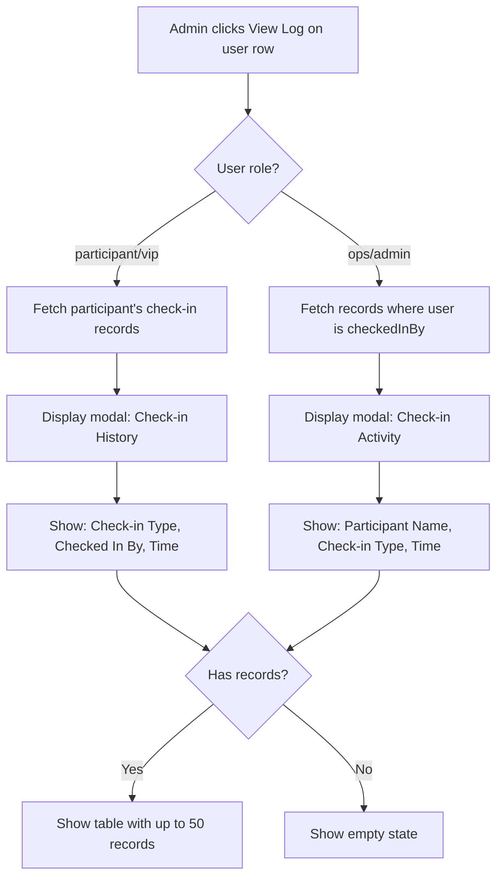

# Check-in Logs Display Feature

## Feature Overview

Add a "View Log" action button to the admin participants table that opens a modal displaying check-in records. The modal content varies based on the user type being viewed:

- **For participants**: Shows their check-in history (which ops user checked them in, when, for which type)
- **For ops users**: Shows the participants they have checked in (who, when, for which type)

This feature supports operational needs during event day by providing visibility into check-in activity.

## Flow Visualization

## Relevant Files

| File | Role |
|------|------|
| `apps/web/src/routes/admin/participants.tsx` | Add View Log action button and modal |
| `apps/web/src/apis/admin/participants.ts` | Add server functions for fetching logs |
| `packages/core/src/business.server/events/schemas/checkin-records.sql.ts` | Existing schema (no changes needed) |
| `packages/core/src/business.server/events/schemas/schema.ts` | Existing relations |

## References and Resources

- Existing check-in records schema already captures: `participantId`, `checkinTypeId`, `checkedInBy`, `checkedInAt`
- Current modal pattern used in participants page (Dialog from shadcn)
- DataTable component available in `@base/ui/components/data-table`

---

## Phase 1: Backend - Server Functions

### Task 1.1: Participant Check-in History Function

**Description:** Create server function to fetch a participant's check-in records with ops user details.

**Relevant files:** `apps/web/src/apis/admin/participants.ts`

- [ ] Create `getParticipantCheckinLogs` server function
- [ ] Accept `participantId` as input parameter
- [ ] Query `checkin_records` joined with `checkin_types` and `users` (for checkedInBy name)
- [ ] Return array of: `{ checkinTypeName, checkedInByName, checkedInAt }`
- [ ] Order by `checkedInAt` descending, limit 50
- [ ] Require admin role

### Task 1.2: Ops Activity Log Function

**Description:** Create server function to fetch all check-ins performed by an ops user.

**Relevant files:** `apps/web/src/apis/admin/participants.ts`

- [ ] Create `getOpsActivityLogs` server function
- [ ] Accept `opsUserId` as input parameter
- [ ] Query `checkin_records` where `checkedInBy = opsUserId`
- [ ] Join with `checkin_types` and `users` (for participant name)
- [ ] Return array of: `{ participantName, participantEmail, checkinTypeName, checkedInAt }`
- [ ] Order by `checkedInAt` descending, limit 50
- [ ] Require admin role

**Dependencies:** None

---

## Phase 2: Frontend - Modal Components

### Task 2.1: Check-in Log Modal Component

**Description:** Create a reusable modal component that displays check-in logs based on context.

**Relevant files:** `apps/web/src/routes/admin/participants.tsx`

- [ ] Create `CheckinLogModal` component within participants page
- [ ] Accept props: `userId`, `userName`, `userRole`, `isOpen`, `onClose`
- [ ] Conditionally render participant view vs ops view based on `userRole`
- [ ] Use Dialog component from shadcn for modal
- [ ] Display appropriate title based on view type

### Task 2.2: Participant Check-in History View

**Description:** Table view showing participant's check-in records.

**Relevant files:** `apps/web/src/routes/admin/participants.tsx`

- [ ] Create table with columns: Check-in Type, Checked In By, Time
- [ ] Use TanStack Query to fetch data from `getParticipantCheckinLogs`
- [ ] Format time as locale string (e.g., "Dec 6, 9:15 AM")
- [ ] Show loading state while fetching
- [ ] Show empty state: "No check-in records found" when empty

### Task 2.3: Ops Activity Log View

**Description:** Table view showing participants checked in by an ops user.

**Relevant files:** `apps/web/src/routes/admin/participants.tsx`

- [ ] Create table with columns: Participant, Check-in Type, Time
- [ ] Use TanStack Query to fetch data from `getOpsActivityLogs`
- [ ] Format time as locale string
- [ ] Show loading state while fetching
- [ ] Show empty state: "No check-in activity found" when empty

**Dependencies:** Task 2.1

---

## Phase 3: Integration

### Task 3.1: Add View Log Action Button

**Description:** Add the View Log button to the actions column in participants table.

**Relevant files:** `apps/web/src/routes/admin/participants.tsx`

- [ ] Add View Log button (with appropriate icon, e.g., `History` or `ClipboardList`) to actions column
- [ ] Pass `onViewLog` callback through table meta
- [ ] Trigger modal open with selected user data

### Task 3.2: Wire Up Modal State

**Description:** Connect modal state and data flow in the participants page.

**Relevant files:** `apps/web/src/routes/admin/participants.tsx`

- [ ] Add state for modal open/close and selected user
- [ ] Implement `handleViewLog` function to set state
- [ ] Render `CheckinLogModal` with appropriate props
- [ ] Handle modal close and state cleanup

**Dependencies:** Task 2.1, Task 3.1

---

## Potential Risks / Edge Cases

| Risk | Mitigation |
|------|------------|
| Large number of records for active ops users | Limited to 50 most recent records |
| Modal opened for user with no check-in records | Show empty state message |
| Determining user type for modal view | Use `role` field (ops/admin shows activity, participant shows history) |
| Performance with joins on large tables | Existing indexes on `checkin_records` (participant_idx, checked_in_by_idx) should handle this |
| Mixed role users (e.g., admin who also scans) | Admins who scan will see their activity in ops view |

---

## Testing Checklist

### View Log Button
- [ ] Button appears in actions column for all user rows
- [ ] Button has appropriate icon and tooltip/label
- [ ] Clicking button opens modal

### Participant Check-in History Modal
- [ ] Modal title shows participant name
- [ ] Table displays correct columns: Check-in Type, Checked In By, Time
- [ ] Records are ordered by most recent first
- [ ] Time is formatted readably
- [ ] Empty state shown when participant has no check-ins
- [ ] Loading state shown while fetching

### Ops Activity Log Modal
- [ ] Modal title shows ops user name
- [ ] Table displays correct columns: Participant, Check-in Type, Time
- [ ] Records are ordered by most recent first
- [ ] Time is formatted readably
- [ ] Empty state shown when ops has no check-in activity
- [ ] Loading state shown while fetching

### Role-based View Selection
- [ ] Clicking View Log on `role=participant` shows check-in history view
- [ ] Clicking View Log on `role=ops` shows activity log view
- [ ] Clicking View Log on `role=admin` shows activity log view (admins can also scan)

### Data Accuracy
- [ ] Check-in records match actual database data
- [ ] Ops user names are correctly resolved
- [ ] Participant names are correctly resolved
- [ ] Maximum 50 records displayed

---

## Notes

- The existing `checkin_records` table already has all required data and indexes
- No schema changes required
- The feature is scoped for operational use during event day, not historical analysis
- Consider adding this same View Log functionality to the ops dashboard in a future iteration if ops need to review their own activity

