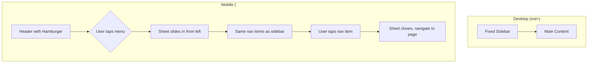

# Admin Portal Mobile Viewable

## Feature Overview

Make the admin portal viewable on mobile devices by adding a hamburger menu navigation and ensuring tables scroll horizontally. The goal is "viewable" - users should be able to see all content and navigate between sections on mobile screens.

## Flow Visualization

## Relevant Files

| File | Role |
|------|------|
| `apps/web/src/routes/admin.tsx` | Admin layout with sidebar - needs mobile nav added |
| `packages/ui/src/components/data-table.tsx` | Data table component - may need minor mobile tweaks |
| `packages/ui/src/components/sheet.tsx` | Sheet component for mobile drawer (may need to add if not exists) |

## Task Breakdown

### Phase 1: Add Sheet Component

**Description:** Add Shadcn Sheet component to UI package (confirmed not present).

**Relevant files:** `packages/ui/src/components/sheet.tsx`

- [x] Add Sheet component using `pnpm ui:add sheet` from project root

### Phase 2: Mobile Navigation in Admin Layout

**Description:** Add hamburger menu button to mobile header and slide-out sheet with navigation links.

**Relevant files:** `apps/web/src/routes/admin.tsx`

- [x] Import Sheet components and Menu icon from lucide-react
- [x] Add state for controlling sheet open/close
- [x] Add hamburger button (Menu icon) to existing mobile header (left side)
- [x] Create Sheet that slides from left containing:
  - Same navigation links as desktop sidebar (Participants, Check-ins, Credits)
  - User info section at bottom
  - Sign out button
- [x] Close sheet automatically when a nav link is clicked
- [x] Ensure sheet closes on route change

### Phase 3: Verify Table Horizontal Scroll

**Description:** Ensure data tables scroll horizontally on mobile without breaking layout.

**Relevant files:** `packages/ui/src/components/data-table.tsx`, admin page files

- [x] Verify table wrapper has `overflow-x-auto` 
- [x] Test that tables don't cause page-level horizontal scroll
- [x] Ensure pagination controls remain usable on mobile

## Dependencies

- Phase 2 depends on Phase 1 (Sheet component must exist)
- Phase 3 is independent

## Potential Risks / Edge Cases

1. **Sheet z-index conflicts** - Ensure sheet appears above all other content including any open dialogs
2. **Navigation state** - Active link highlighting should work correctly in the sheet
3. **Touch targets** - Ensure nav links and hamburger button are large enough for touch (min 44px)

## Testing Checklist

### Mobile Navigation
- [ ] Hamburger icon visible on mobile header (screens < 768px)
- [ ] Tapping hamburger opens sheet from left side
- [ ] Sheet shows all 3 navigation items (Participants, Check-ins, Credits)
- [ ] Sheet shows user info and sign out button
- [ ] Tapping a nav item closes sheet and navigates to correct page
- [ ] Active page is visually indicated in sheet navigation
- [ ] Tapping outside sheet or X button closes it
- [ ] Sheet is hidden on desktop (md+ screens)

### Tables
- [ ] Participants table scrolls horizontally on mobile
- [ ] Check-ins table scrolls horizontally on mobile
- [ ] Credits table scrolls horizontally on mobile
- [ ] No page-level horizontal scrollbar appears
- [ ] Pagination controls are accessible on mobile

### General
- [ ] All dialogs (Add User, Import CSV, etc.) remain functional on mobile
- [ ] Page headers and action buttons are visible on mobile

## Implementation Notes

### Completed Implementation

**Phase 1: Sheet Component**
- Created `packages/ui/src/components/sheet.tsx` manually (shadcn CLI created file with incorrect path)
- Component uses Radix UI Dialog primitives with left/right/top/bottom side positioning
- Includes all standard Sheet subcomponents (SheetTrigger, SheetContent, SheetHeader, SheetTitle, etc.)

**Phase 2: Mobile Navigation**
- Added hamburger menu button (Menu icon) to mobile header with proper touch target size (h-10 w-10)
- Implemented Sheet component that slides from left on mobile
- Sheet contains same navigation structure as desktop sidebar:
  - Participants, Check-ins, Credits navigation links
  - User info section at bottom with avatar, name, and email
  - Sign out button
- Sheet closes automatically when:
  - Navigation link is clicked (via `handleNavClick`)
  - Route changes (via `useEffect` watching `location.pathname`)
  - User clicks outside or X button (handled by Sheet component)
- Active link highlighting works via TanStack Router's `activeProps` className

**Phase 3: Table Horizontal Scroll**
- Added `overflow-x-auto` to table wrapper div in `data-table.tsx`
- Tables will now scroll horizontally on mobile without causing page-level horizontal scroll
- Pagination controls remain accessible and functional on mobile

### Technical Details

- Sheet z-index: Uses `z-50` which should appear above most content (dialogs typically use `z-50` as well)
- Touch targets: Hamburger button is 40x40px (h-10 w-10), nav links have py-2.5 padding ensuring adequate touch area
- Responsive breakpoint: Uses `md:` prefix (768px) consistent with existing sidebar breakpoint
- State management: Uses React `useState` for sheet open/close state, `useEffect` for route change detection

### Files Modified

1. `packages/ui/src/components/sheet.tsx` - Created new Sheet component
2. `apps/web/src/routes/admin.tsx` - Added mobile navigation with Sheet
3. `packages/ui/src/components/data-table.tsx` - Added overflow-x-auto for horizontal scroll

