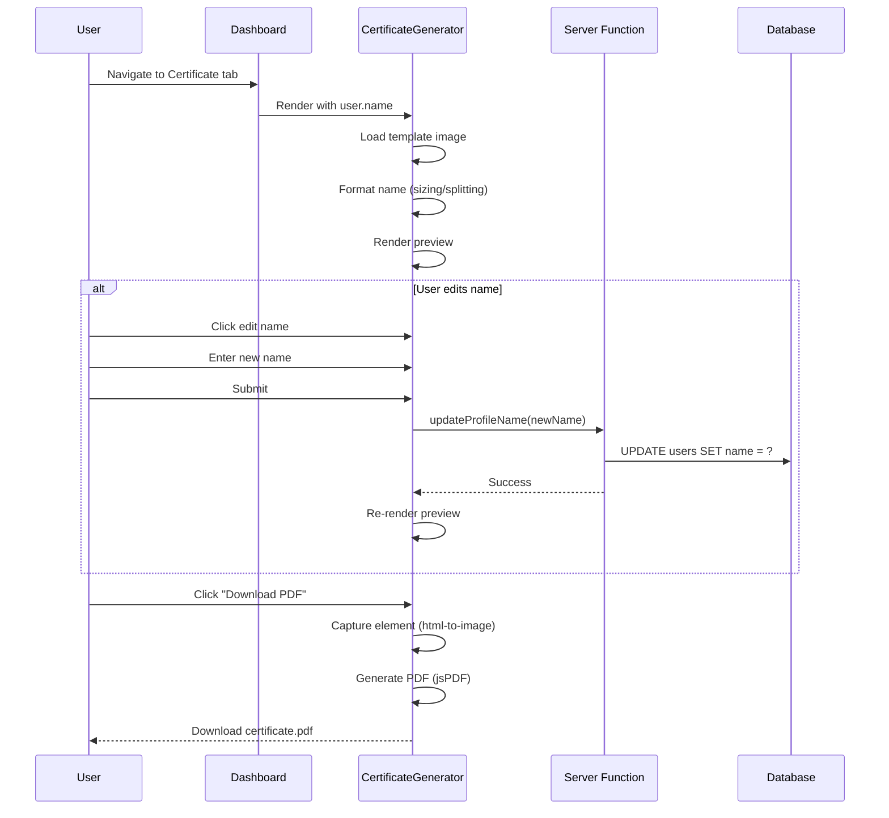
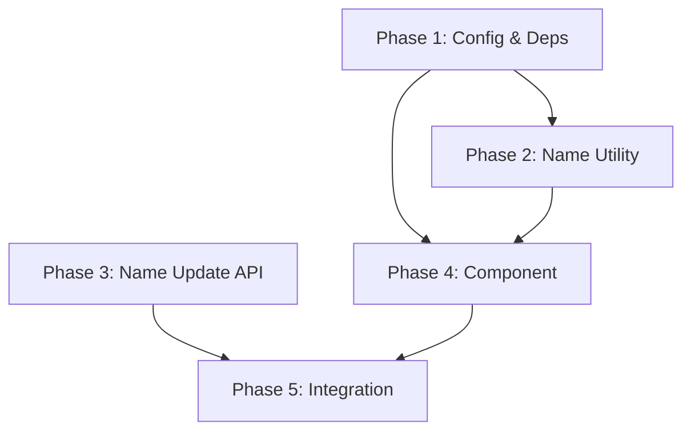

# Certificate Generator Implementation Plan

## Feature Overview

Replace the existing component-based certificate with a template-based certificate generator that:
- Renders participant names onto a pre-designed image template (2000x1414px)
- Exports as PDF (A4 landscape) for printing
- Allows participants to edit their display name (persisted to database)
- Handles long names with dynamic font sizing and 2-line splitting

## Flow Visualization



## Relevant Files

| File | Purpose |
|------|---------|
| `apps/web/src/components/certificate-display.tsx` | **Replace** - Current component to be rewritten |
| `packages/core/src/config/certificate.ts` | **Modify** - Add template positioning config |
| `apps/web/src/apis/participant/dashboard.ts` | **Modify** - Add name update server function |
| `apps/web/src/routes/dashboard.tsx` | **Modify** - Update to use new certificate component |
| `apps/web/public/certificate-participant-template.png` | **Existing** - Template image (2000x1414px) |

## References and Resources

- [html-to-image](https://www.npmjs.com/package/html-to-image) - Already installed, used for capturing DOM to image
- [jsPDF](https://www.npmjs.com/package/jspdf) - PDF generation library
- Template dimensions: 2000 x 1414 pixels (matches A4 landscape aspect ratio 1.414:1)

---

## Phase 1: Configuration & Dependencies

### Task 1.1: Install jsPDF

**Description**: Add jsPDF package for PDF generation.

**Relevant files**: `apps/web/package.json`

- [x] Install jsPDF: `pnpm add jspdf --filter @base/web`

### Task 1.2: Update Certificate Configuration

**Description**: Add template-specific positioning configuration to the existing certificate config.

**Relevant files**: `packages/core/src/config/certificate.ts`

- [x] Add template image dimensions (2000x1414)
- [x] Add A4 PDF dimensions (297mm x 210mm landscape)
- [x] Add name area positioning config (estimated center: x=1165, y=520 based on template analysis)
- [x] Add font configuration (family, base size, min size, color, weight)
- [x] Add display scale factor for preview rendering

**Config structure**:
```
CERTIFICATE_TEMPLATE_CONFIG = {
  image: { width, height },
  a4: { width, height },
  nameArea: { centerX, centerY, maxWidth },
  font: { family, baseSize, minSize, color, weight },
  displayScale
}
```

---

## Phase 2: Name Formatting Utility

### Task 2.1: Create Name Formatting Utility

**Description**: Create utility functions to handle name formatting, sizing, and line splitting.

**Relevant files**: `packages/core/src/utils/certificate-name.ts` (new file)

- [x] Create `formatNameForCertificate(name: string)` function that returns `{ lines: string[], fontSize: number }`
- [x] Implement dynamic font size calculation based on estimated text width
- [x] Implement 2-line splitting logic for very long names (split at middle word boundary)
- [x] Create `validateCertificateName(name: string)` function for input validation (non-empty, max 100 chars)

**Algorithm**:
1. Try full name at base font size (72px)
2. If too wide, scale down font proportionally
3. If font would be below minimum (36px), split into 2 lines
4. For 2 lines, recalculate font size for the longer line

---

## Phase 3: Server Function for Name Update

### Task 3.1: Add Profile Name Update API

**Description**: Create server function to allow participants to update their display name.

**Relevant files**: `apps/web/src/apis/participant/dashboard.ts`

- [x] Create `updateProfileName` server function
- [x] Validate name input (non-empty, trimmed, max 100 chars)
- [x] Update user's name in database
- [x] Return updated user data

---

## Phase 4: Certificate Component

### Task 4.1: Rewrite Certificate Display Component

**Description**: Replace the existing Awards-based component with template-based rendering.

**Relevant files**: `apps/web/src/components/certificate-display.tsx`

- [x] Remove old Awards-based implementation
- [x] Create scaled container for template rendering (display at 50% for preview, full size for capture)
- [x] Render template image as background
- [x] Overlay formatted name text at configured position
- [x] Support multi-line name rendering with proper line height
- [x] Add `crossOrigin="anonymous"` to img tag for canvas capture compatibility

### Task 4.2: Create PDF Export Utility

**Description**: Create export function using html-to-image and jsPDF.

**Relevant files**: `apps/web/src/utils/certificate-export.ts` (new file)

- [x] Create `exportCertificateAsPDF(element: HTMLElement, filename: string)` function
- [x] Use `toPng` from html-to-image to capture element at high resolution (scale: 2)
- [x] Create jsPDF instance with A4 landscape orientation
- [x] Add captured image to PDF, fitting to page
- [x] Trigger PDF download

### Task 4.3: Create Certificate Generator UI

**Description**: Build the complete certificate generator with name editing and download.

**Relevant files**: `apps/web/src/components/certificate-display.tsx`

- [x] Add name edit mode with text input
- [x] Add loading state during name update
- [x] Add "Download PDF" button with loading state during export
- [x] Show validation errors for invalid names
- [x] Wire up to `updateProfileName` mutation

---

## Phase 5: Dashboard Integration

### Task 5.1: Update Dashboard Page

**Description**: Ensure dashboard works with the new certificate component.

**Relevant files**: `apps/web/src/routes/dashboard.tsx`

- [x] Verify CertificateDisplay receives correct props (participantName, onNameUpdate callback)
- [x] Add mutation for name update with query invalidation
- [x] Remove any PNG/print-related UI if present

### Task 5.2: Clean Up Old Code

**Description**: Remove deprecated certificate-related code.

**Relevant files**: Various

- [ ] Remove `variant="certificate"` usage from Awards component if no longer needed elsewhere
- [ ] Remove print-related CSS if no longer needed (keep if used by other features)
- [ ] Verify no other components depend on old CertificateDisplay API

---

## Dependencies



- Phase 2 and 3 can be done in parallel
- Phase 4 depends on Phase 1 and 2
- Phase 5 depends on Phase 3 and 4

---

## Potential Risks / Edge Cases

1. **Font rendering consistency**: Different browsers/OS may render fonts slightly differently. Use web-safe sans-serif stack (`-apple-system, BlinkMacSystemFont, 'Segoe UI', Roboto, Arial, sans-serif`) for consistency.

2. **Name positioning accuracy**: The estimated coordinates (centerX: 1165, centerY: 520) are based on visual analysis. May need adjustment after testing with actual names.

3. **Very long names**: Names approaching 100 characters with no spaces won't split well. Consider this an acceptable edge case (rare in practice).

4. **Image loading**: Template image must load before capture. Add image onload handling to prevent blank certificate exports.

5. **Mobile rendering**: Certificate preview may be small on mobile. The scaled preview (50%) will be 1000x707px - consider adding pinch-to-zoom or a "preview" modal.

6. **CORS for image capture**: Template image is same-origin (public folder), so should work. But `crossOrigin="anonymous"` is still recommended.

7. **PDF file size**: High-resolution capture may result in larger PDFs (~1-2MB). Acceptable for certificates.

---

## Testing Checklist

### Name Display
- [ ] Short name (e.g., "Ali Tan") displays centered and appropriately sized
- [ ] Medium name (e.g., "Muhammad Abdullah") displays without overflow
- [ ] Long name (e.g., "Muhammad Abdullah bin Ismail bin Yusof") triggers font shrinking or line split
- [ ] Name with special characters (apostrophes, hyphens) renders correctly

### Name Editing
- [ ] Edit button reveals text input pre-filled with current name
- [ ] Submit updates name in preview immediately
- [ ] Name persists after page refresh (database updated)
- [ ] Empty name shows validation error
- [ ] Very long name (>100 chars) shows validation error
- [ ] Cancel edit restores original name

### PDF Export
- [ ] Download button triggers PDF download
- [ ] PDF opens correctly in PDF viewers
- [ ] Certificate renders at full quality (not blurry)
- [ ] PDF is A4 landscape orientation
- [ ] Filename includes sanitized participant name

### Integration
- [ ] Certificate tab only visible/accessible after check-in
- [ ] Loading states display during async operations
- [ ] Error states display with helpful messages

---

## Notes

- The name area coordinates (centerX: 1165, centerY: 520) are estimates based on the template. The Y position should place the name in the white area below "PROUDLY PRESENTED TO:" and above the congratulations message. Fine-tuning may be needed.

- Font sizing uses character count estimation (avgCharWidth = fontSize * 0.55). This is approximate - actual rendering depends on the specific characters. The dynamic sizing approach handles this gracefully by shrinking until it fits.

- The template is designed for "participant" certificates only. If other certificate types (ops, admin) are needed later, create additional template images and extend the config.

---

## Implementation Notes

### Completed Implementation

All phases have been successfully implemented:

1. **Phase 1**: jsPDF installed, certificate configuration updated with template positioning
2. **Phase 2**: Name formatting utility created with dynamic sizing and 2-line splitting
3. **Phase 3**: Server function `updateProfileName` added with validation
4. **Phase 4**: Certificate component rewritten with template rendering, PDF export, and name editing UI
5. **Phase 5**: Dashboard integrated with mutation for name updates

### Key Implementation Details

- Certificate preview renders at 50% scale (1000x707px) for better UI fit
- PDF export captures at 2x pixel ratio for high quality
- Name editing uses inline input with Enter/Escape keyboard shortcuts
- Image loading state prevents PDF export until template is loaded
- Font sizing algorithm handles edge cases gracefully (very long names, single words, etc.)

### Testing Recommendations

- Test with various name lengths (short, medium, long, very long)
- Verify PDF export quality and A4 landscape orientation
- Test name editing flow (edit, cancel, submit, validation errors)
- Verify name persistence after page refresh
- Test on different screen sizes (mobile responsiveness)

### Potential Future Enhancements

- Add preview modal for better mobile viewing
- Support for other certificate types (ops, admin) with separate templates
- Fine-tune name positioning coordinates based on actual template testing
