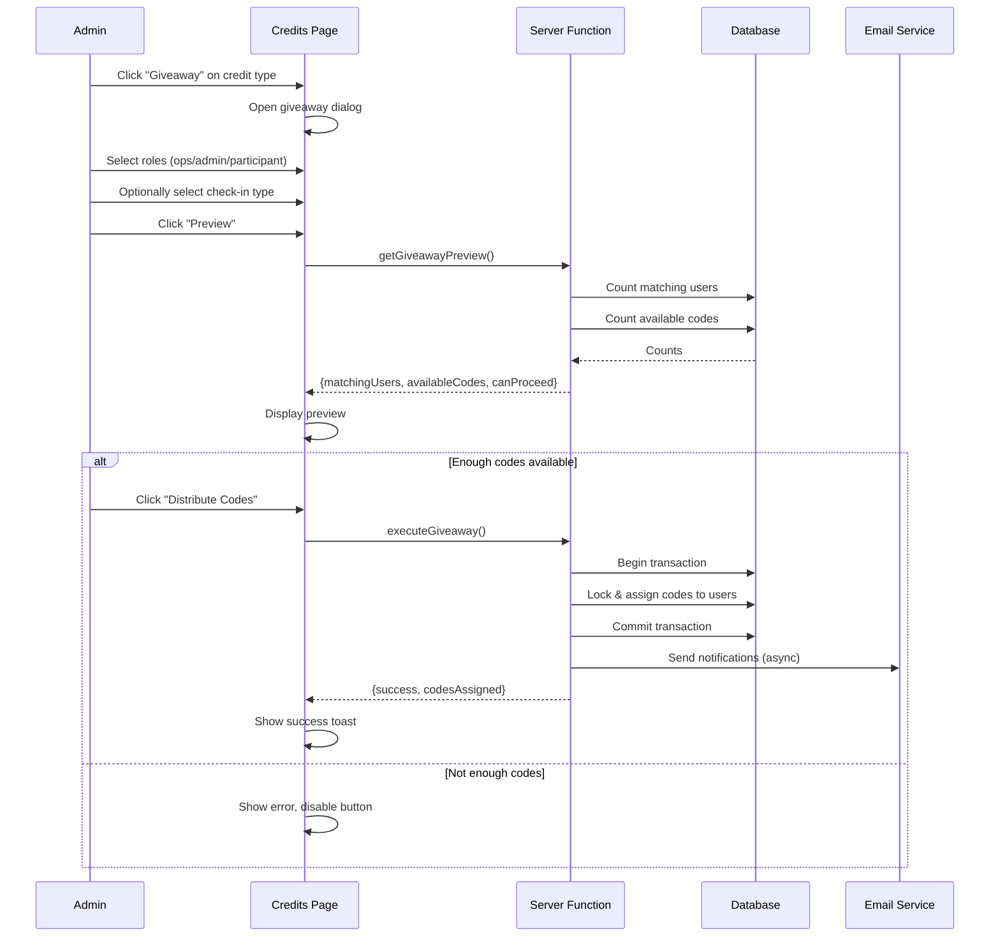

# Giveaway Codes Feature Plan

## Feature Overview

Admin can bulk-distribute (giveaway) codes for a specific credit type to targeted users based on role and check-in filters. This feature allows additional code distribution beyond the automatic assignment that occurs during first check-in.

**Key Behaviors:**
- Users can receive multiple codes of the same credit type (existing + giveaway)
- Transaction fails entirely if insufficient codes in pool (no partial assignment)
- Email notifications sent to recipients
- Works for both unique and universal distribution types

## Flow Visualization

## Relevant Files

| File | Purpose |
|------|---------|
| `apps/web/src/routes/admin/credits.tsx` | Add giveaway button and dialog UI |
| `apps/web/src/apis/admin/credits.ts` | Add giveaway server functions |
| `packages/core/src/business.server/events/schemas/schema.ts` | Existing schema relations |
| `packages/core/src/config/constant.ts` | Role and check-in type constants |
| `packages/core/src/email/templates/checkin-confirmation.ts` | Reference for giveaway email template |

## References and Resources

- Existing code assignment logic: `apps/web/src/apis/ops/checkin.ts` (lines 132-185)
- Check-in records query pattern: `apps/web/src/apis/admin/participants.ts`
- Email template structure: `packages/core/src/email/templates/checkin-confirmation.ts`
- Dialog pattern: `apps/web/src/routes/admin/credits.tsx` (import dialog)

## Task Breakdown

### Phase 1: Backend API

#### Task 1.1: Giveaway Preview Server Function
- Description: Create server function to calculate matching users and available codes
- Relevant files: `apps/web/src/apis/admin/credits.ts`
- [x] Create `getGiveawayPreviewInputSchema` with creditTypeId, roles array, optional checkinTypeId
- [x] Implement user filtering query: join Users with CheckinRecords when filter applied
- [x] Count users matching criteria (role in selected roles, optionally checked in for type)
- [x] For participant role: filter to `participantType = 'regular'` only (exclude VIP)
- [x] Count available codes in pool for credit type
- [x] Return `{matchingUsers, availableCodes, canProceed}`

#### Task 1.2: Execute Giveaway Server Function
- Description: Bulk assign codes to filtered users within a transaction
- Relevant files: `apps/web/src/apis/admin/credits.ts`
- [x] Create `executeGiveawayInputSchema` with same filters as preview
- [x] Validate sufficient codes exist before starting transaction
- [x] Get list of matching user IDs
- [x] Within transaction: lock and assign codes using `FOR UPDATE SKIP LOCKED`
- [x] Fail transaction if any user cannot get a code
- [x] Return list of assigned codes with user info for email dispatch

#### Task 1.3: Email Notification
- Description: Send giveaway notification emails to recipients
- Relevant files: `packages/core/src/email/templates/`
- [x] Create `giveaway-notification.ts` email template
- [x] Include credit type name, code value, redeem URL, instructions
- [x] Trigger email sending after successful giveaway (can be async/background)

**Dependencies:** Task 1.1 must complete before 1.2. Task 1.3 can be parallel with 1.1/1.2.

---

### Phase 2: Frontend UI

#### Task 2.1: Giveaway Dialog Component
- Description: Create dialog for giveaway configuration and execution
- Relevant files: `apps/web/src/routes/admin/credits.tsx`
- [x] Add "Giveaway" button to actions column (alongside Import, Edit, etc.)
- [x] Create GiveawayDialog component with:
  - Multi-select for roles (ops, admin, participant) using checkboxes
  - Optional single-select dropdown for check-in type
  - Preview section showing matching users / available codes
  - "Preview" button to fetch counts
  - "Distribute Codes" button (disabled if canProceed=false)
- [x] Show loading states during preview and execution
- [x] Display success/error feedback

#### Task 2.2: Integrate with TanStack Query
- Description: Wire up mutations and queries for giveaway operations
- Relevant files: `apps/web/src/routes/admin/credits.tsx`
- [x] Create `useQuery` for fetching check-in types (for dropdown)
- [x] Create `useMutation` for preview (triggered on button click, not auto)
- [x] Create `useMutation` for execute giveaway
- [x] Invalidate credit-types query on successful giveaway (refresh pool stats)

**Dependencies:** Phase 1 must be complete. Task 2.1 and 2.2 are parallel.

---

### Phase 3: Polish and Edge Cases

#### Task 3.1: Error Handling
- Description: Handle edge cases gracefully
- Relevant files: `apps/web/src/apis/admin/credits.ts`, `apps/web/src/routes/admin/credits.tsx`
- [x] Handle concurrent giveaway attempts (transaction isolation)
- [x] Clear error messages for: no matching users, no available codes, transaction failure
- [x] Disable giveaway button for inactive credit types

#### Task 3.2: UI Polish
- Description: Improve user experience
- Relevant files: `apps/web/src/routes/admin/credits.tsx`
- [x] Show warning when available codes < matching users in preview
- [x] Confirmation dialog before execution with final counts
- [x] Success toast with count of codes distributed

**Dependencies:** Phase 2 must be complete.

## Potential Risks / Edge Cases

1. **Race condition**: Multiple admins triggering giveaway simultaneously
   - Mitigation: Use `FOR UPDATE SKIP LOCKED` and transaction-level validation

2. **Large user sets**: Giveaway to thousands of users
   - Mitigation: Batch database operations, consider background job for emails

3. **Email failures**: Some emails fail to send
   - Mitigation: Log failures, don't block transaction success on email delivery

4. **Universal codes**: Same code shared by all recipients
   - Mitigation: For universal distribution, assign same codeValue to all (still create individual code records)

5. **User has no email**: Edge case for notification
   - Mitigation: Skip email for users with unverified/missing email, log warning

## Testing Checklist

### Giveaway Dialog
- [ ] Dialog opens when clicking "Giveaway" button on a credit type
- [ ] Can select/deselect multiple roles (ops, admin, participant)
- [ ] Check-in type dropdown shows active check-in types
- [ ] Can leave check-in type unselected (optional filter)

### Preview Flow
- [ ] Clicking "Preview" shows loading state
- [ ] Preview displays correct count of matching users
- [ ] Preview displays correct count of available codes
- [ ] "Distribute Codes" button disabled when available < matching
- [ ] Error shown when no users match filter

### Distribution Flow
- [ ] Clicking "Distribute" shows loading/progress state
- [ ] Success toast shows number of codes distributed
- [ ] Pool stats update after successful giveaway
- [ ] Dialog closes on success

### Email Notifications
- [ ] Recipients receive email with correct code details
- [ ] Email includes credit type name and instructions

### Edge Cases
- [ ] Giveaway blocked for inactive credit types
- [ ] Participant filter excludes VIP users
- [ ] Transaction fails cleanly if codes run out mid-process
- [ ] Concurrent giveaway attempts don't cause double-assignment

## Implementation Notes

### Files Created/Modified

| File | Changes |
|------|---------|
| `apps/web/src/apis/admin/credits.ts` | Added `getGiveawayPreview` and `executeGiveaway` server functions |
| `apps/web/src/routes/admin/credits.tsx` | Added Giveaway dialog with role/checkin filters, preview/execute flow |
| `packages/core/src/email/templates/giveaway-notification.ts` | New email template for giveaway notifications |
| `packages/ui/src/components/checkbox.tsx` | Added Checkbox component (shadcn) |

### Key Implementation Details

1. **User Filtering Logic**: The `getMatchingUserIds` helper function handles complex role filtering:
   - For `participant` role: filters to `participantType = 'regular'` only (excludes VIP)
   - For other roles: simple role match
   - When checkinTypeId is provided: joins with CheckinRecords table

2. **Transaction Isolation**: Uses `FOR UPDATE SKIP LOCKED` to prevent concurrent giveaway attempts from assigning the same code to multiple users

3. **Email Sending**: Fire-and-forget pattern - emails are sent asynchronously after transaction commits, failures are logged but don't block the response

4. **UI State Flow**:
   - Preview must be triggered before execution is allowed
   - `canProceed` flag controls whether distribution button is enabled
   - Success state shows count of distributed codes and email notification message

### Deviations from Plan

- Skipped confirmation dialog before execution (Task 3.2) - the preview step already shows counts, and the Distribute button label shows the count as well, providing enough confirmation context
